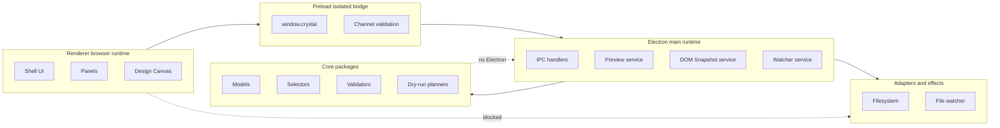

# Runtime Boundaries Diagram

[Docs index](../../README.md)

## Purpose

This diagram shows which runtime is allowed to own which responsibility.

## Current implementation

## Key files

- `apps/desktop/electron/main/**`
- `apps/desktop/electron/preload/**`
- `apps/desktop/electron/renderer/**`
- `packages/core/**`
- `packages/adapters/**`

## Data flow

Renderer uses preload; preload invokes main; main uses core and adapters. Core stays portable.

## Boundaries

Renderer cannot bypass preload. Core should not import Electron. Adapters isolate side effects.

## Validation

Covered by `validate:structure`, `validate:ui-flow`, and feature validators.

## Related docs

- [Runtime boundaries](../runtime-boundaries.md)
- [Module boundaries](../module-boundaries.md)
- [Security model](../security-model.md)

## Future work

Future workers, WASM, and WebGPU need dedicated runtime boxes and explicit bridges.
