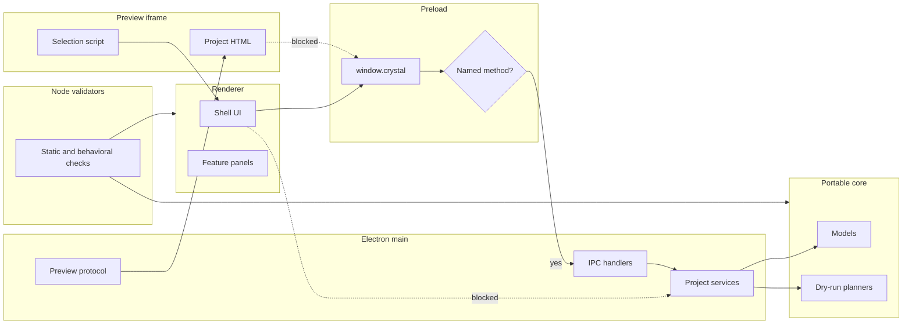

# Runtime boundaries diagram

[Docs index](../../README.md)

## Purpose

This diagram answers where code executes and which runtime may own effects. Use it before moving behavior across renderer, preload, main, core, or Preview.

## Current implementation

The allowed path for privileged work is renderer → constrained preload → main. Main coordinates core and adapters. Preview iframe remains a separate untrusted runtime that can emit only bounded messages. Validator scripts inspect source and docs from Node without entering the product runtime.

## Key files

- `apps/desktop/electron/renderer`
- `apps/desktop/electron/preload`
- `apps/desktop/electron/main`
- `packages/core`
- `packages/adapters`
- `scripts`

## Data flow

Cross-runtime data uses typed plain contracts. Renderer cannot import main effects. Core does not require Electron. Preview content cannot call preload. Validators read repository state and report results outside the application.

## Boundaries

A process boundary is an authority boundary. Moving code to a shared package does not make its effects portable. Future worker or WASM calls require explicit typed ports and output validation.

## Validation

`validate:structure`, `validate:source-tree-boundaries`, `validate:ui-flow`, and feature validators cover current runtime direction and forbidden shortcuts.

## Related docs

- [Runtime boundaries](../runtime-boundaries.md)
- [Module boundaries](../module-boundaries.md)
- [Security model](../security-model.md)

## Future work

Add dedicated boxes for workers, WebGPU, WASM, and write execution when their messages, effects, fallbacks, and validators are concrete.
