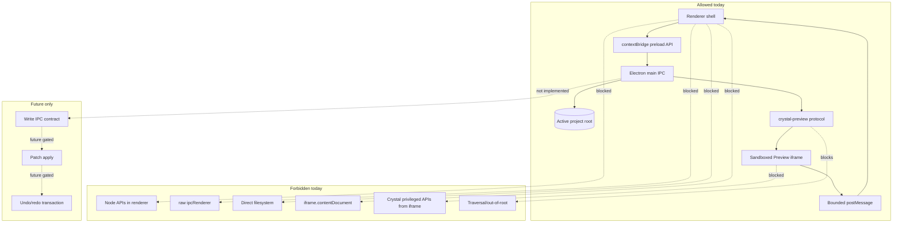

# Security Boundaries Diagram

[Docs index](../../README.md)

## At a glance

| Question | Answer |
| --- | --- |
| Is this implemented? | Yes, as documented boundaries. |
| Can security boundaries be relaxed for Preview convenience? | No. |
| Runtime owner | Main/preload/renderer/iframe split. |
| Safety risk controlled | Separates allowed, forbidden, and future authority. |
| Related next phase | Future writes must add gates, not remove boundaries. |

## Purpose

This diagram shows the security edges that protect Crystal while it loads real project HTML.

## Why this exists

A contributor should be able to see at a glance which shortcuts are forbidden before touching Preview, preload, or Electron settings.

## How to read this page

Allowed edges are solid. Forbidden shortcuts are dotted from current nodes. Future-only nodes are separated from current implementation.

## Current implementation

Only the preload bridge may connect renderer UI to main. Preview is served through a constrained protocol. The iframe can send bounded selection messages, but it cannot access Crystal privileges.

| Implemented | Blocked | Future |
| --- | --- | --- |
| Constrained preload. | Raw IPC. | Write IPC only after design. |
| Root-contained protocol. | Traversal/out-of-root serving. | Write gates. |
| Bounded iframe messages. | Live iframe DOM reads. | More selection messages with same boundary. |

## Key files

These files implement the security boundaries shown above.

## Key files and responsibilities

| File | Responsibility | Reads | Must not do |
| --- | --- | --- | --- |
| `web-preferences.ts` | BrowserWindow security. | Electron options. | Relax security. |
| `crystal-api.bridge.ts` | API bridge. | IPC constants. | Expose raw IPC. |
| `project-preview-protocol.ts` | Safe serving. | Active root. | Serve arbitrary local files. |
| `project-preview-selection-message-bridge.ts` | Bounded messages. | Event payloads. | Read iframe DOM. |

## Data flow

Only sanitized, typed, bounded data crosses boundaries. Project files are served only after root containment checks.

## Main diagram

## Boundaries

No `allow-same-origin` shortcut. No live iframe document reads. No renderer filesystem writes.

## What this does not do

| Not provided | Reason |
| --- | --- |
| Write contract | Future-only. |
| Security relaxation | Explicitly forbidden. |
| Raw project path exposure | Diagnostics remain sanitized. |

## Common misunderstanding

> **Common misunderstanding:** Security boundaries are not styling preferences; they define which code can hold authority.

## Validation

Covered by security checks inside feature validators and `validate:architecture-docs` for docs presence.

## Related docs

- [Security model](../security-model.md)
- [Preview safety](../preview/preview-safety.md)
- [ADR 0001](../../decisions/0001-electron-security-boundaries.md)

## Future work

Future write features must add gates, not remove these boundaries.
