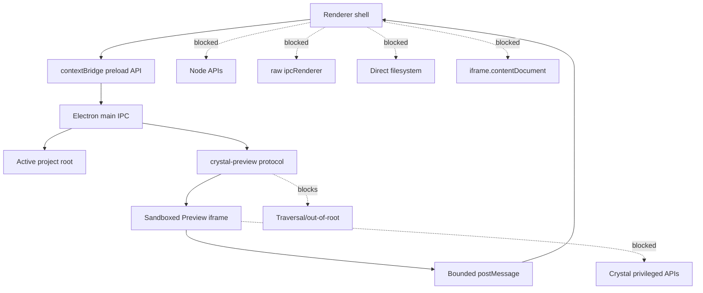

# Security Boundaries Diagram

[Docs index](../../README.md)

## Purpose

This diagram shows the security edges that protect Crystal while it loads real project HTML.

## Current implementation

Only the preload bridge may connect renderer UI to main. Preview is served through a constrained protocol. The iframe can send bounded selection messages, but it cannot access Crystal privileges.

## Key files

These files implement the security boundaries shown above.

- `apps/desktop/electron/main/security/web-preferences.ts`
- `apps/desktop/electron/preload/bridges/crystal-api.bridge.ts`
- `apps/desktop/electron/main/preview/project-preview-protocol.ts`
- `apps/desktop/electron/renderer/components/project-preview-panel/selection/project-preview-selection-message-bridge.ts`

## Data flow

Only sanitized, typed, bounded data crosses boundaries. Project files are served only after root containment checks.

## Boundaries

No `allow-same-origin` shortcut. No live iframe document reads. No renderer filesystem writes.

## Validation

Covered by security checks inside feature validators and `validate:architecture-docs` for docs presence.

## Related docs

- [Security model](../security-model.md)
- [Preview safety](../preview/preview-safety.md)
- [ADR 0001](../../decisions/0001-electron-security-boundaries.md)

## Future work

Future write features must add gates, not remove these boundaries.
