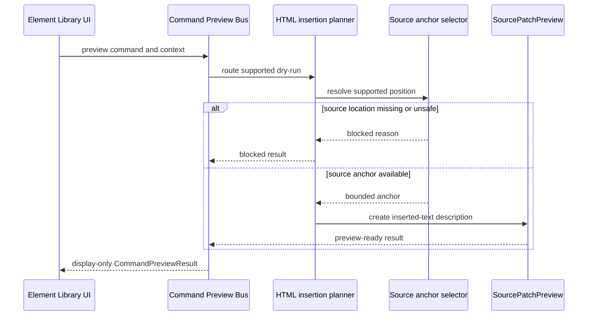

# Source Patch Preview sequence diagram

[Docs index](../../README.md)

## Purpose

The sequence shows where a possible HTML insertion becomes concrete source text and where the current path stops.

## Current implementation

A supported command reaches the dry-run bus. The planner validates current context and asks the source-anchor selector for a safe before, after, or inside position. Missing or unsafe source location returns blocked state. A valid anchor produces Source Patch Preview for renderer display.

## Key files

- `html-source-anchor.selectors.ts`
- `html-insertion-command.validators.ts`
- `html-insertion-command.planner.ts`
- `html-insertion-command.preview.ts`
- `command-preview.renderer.ts`

## Data flow

Command and target evidence move inward; a plain result moves outward. No participant has persistence authority.

## Boundaries

The sequence ends at display. It contains no patch apply, write IPC, file save, executable transaction, or refresh effect.

## Validation

`npm run validate:source-patch-preview` checks both successful and blocked branches and rejects write behavior.

## Related docs

- [Source Patch Preview](../commands/source-patch-preview.md)
- [Source Patch Preview flow](../flows/source-patch-preview-flow.md)

## Future work

A write sequence should begin from a fresh validated transaction, not by appending a writer call to this dry-run planner.
