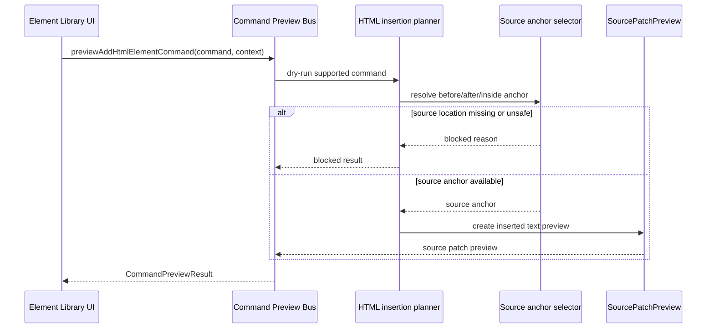

# Source Patch Preview Sequence Diagram

[Docs index](../../README.md)

## At a glance

| Question | Answer |
| --- | --- |
| Is this implemented? | Yes, as dry-run preview sequence. |
| Can it apply patches? | No. |
| Runtime owner | Renderer asks; core plans; renderer displays. |
| Safety risk controlled | Blocks missing/unsafe source anchors. |
| Related next phase | Future patch apply after transactions. |

## Purpose

This sequence shows how a possible insertion is described as source text without being applied.

## Why this exists

It gives contributors a visual way to see where preview planning stops and why write execution is not part of the current path.

## How to read this page

The `alt` branch is the critical part: blocked preview is expected when source location is unavailable.

## Current implementation

The planner needs a valid command, a safe target, and a source anchor. If any part is missing, the preview is blocked. The successful path returns display data only.

| Implemented | Blocked | Future |
| --- | --- | --- |
| SourcePatchPreview output. | Patch apply. | Atomic apply service. |
| Blocked status. | File write. | Undo transaction. |

## Key files

These files resolve anchors and format the preview.

## Key files and responsibilities

| File | Responsibility | Reads | Must not do |
| --- | --- | --- | --- |
| `html-source-anchor.selectors.ts` | Anchor resolution. | Snapshot source location. | Guess missing data. |
| `html-insertion-command.planner.ts` | Dry-run planning. | Command + anchor. | Apply patch. |
| `html-insertion-command.preview.ts` | Preview formatting. | Planner state. | Persist files. |

## Data flow

The preview result explains a possible source edit. It does not apply the edit.

## Main diagram

## Boundaries

No patch apply, no write IPC, no file persistence.

## What this does not do

| Not provided | Reason |
| --- | --- |
| Source mutation | Dry-run only. |
| Save/apply | Future-only. |
| Undo/redo | No transaction. |

## Common misunderstanding

> **Common misunderstanding:** The source patch preview sequence ends before a writer exists.

## Validation

Covered by `validate:source-patch-preview`.

## Related docs

- [Source Patch Preview](../commands/source-patch-preview.md)
- [Source Patch Preview flow](../flows/source-patch-preview-flow.md)

## Future work

Future patch application must be separate and transaction-aware.
