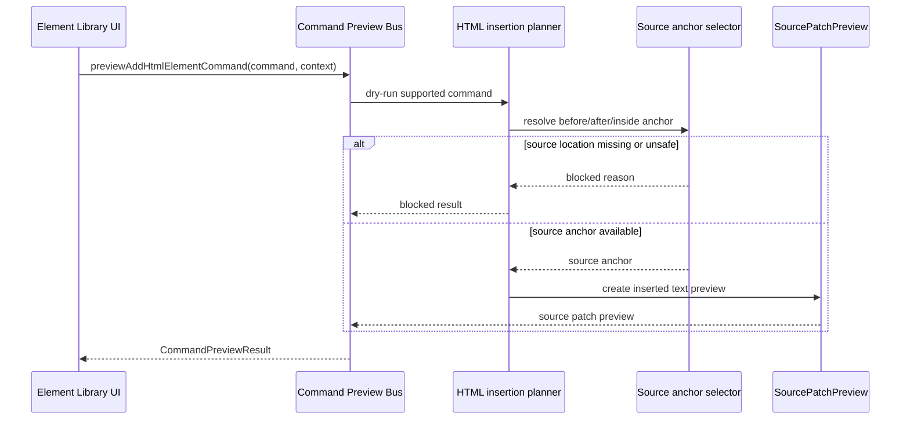

# Source Patch Preview Sequence Diagram

[Docs index](../../README.md)

## Purpose

This sequence shows how a possible insertion is described as source text without being applied.

## Current implementation

The planner needs a valid command, a safe target, and a source anchor. If any part is missing, the preview is blocked. The successful path returns display data only.

## Key files

These files resolve anchors and format the preview.

- `packages/core/source-patch/html-source-anchor.selectors.ts`
- `packages/core/commands/html-insertion/html-insertion-command.planner.ts`
- `packages/core/commands/html-insertion/html-insertion-command.preview.ts`

## Data flow

The preview result explains a possible source edit. It does not apply the edit.

## Boundaries

No patch apply, no write IPC, no file persistence.

## Validation

Covered by `validate:source-patch-preview`.

## Related docs

- [Source Patch Preview](../commands/source-patch-preview.md)
- [Source Patch Preview flow](../flows/source-patch-preview-flow.md)

## Future work

Future patch application must be separate and transaction-aware.
