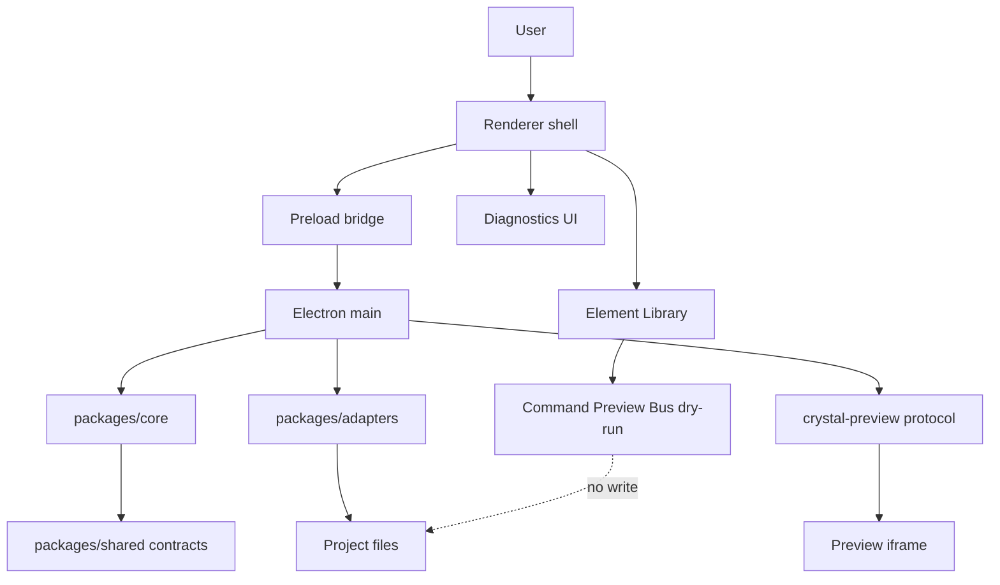

# System Context Diagram

[Docs index](../../README.md)

## Purpose

This diagram gives a one-screen view of Crystal's current system shape. Use it to see which runtime owns which kind of responsibility before reading a specific feature page.

## Current implementation

Renderer presents UI. Preload narrows the bridge. Main owns privileged effects. Core packages model state and dry-run planning. Adapters touch filesystem and watcher effects. The dashed file edge is the important boundary: command preview does not write.

## Key files

These are entry points for the diagram boxes.

- `apps/desktop/electron/main/main.ts`
- `apps/desktop/electron/preload/bridges/crystal-api.bridge.ts`
- `apps/desktop/electron/renderer/app/bootstrap/bootstrap.ts`
- `packages/core/**`
- `packages/adapters/**`
- `packages/shared/**`

## Data flow

User actions begin in renderer and move toward main only through preload. Main delegates logic to core and effects to adapters. Preview rendering is isolated from command preview.

## Boundaries

Renderer has no direct filesystem access. Command Preview Bus does not apply changes.

## Validation

Covered by runtime, preview, command, and docs validators.

## Related docs

- [System overview](../system-overview.md)
- [Runtime boundaries](./runtime-boundaries.md)
- [Security boundaries](./security-boundaries.md)

## Future work

Add Future worker, WASM, and WebGPU nodes only when their runtime contracts exist.
