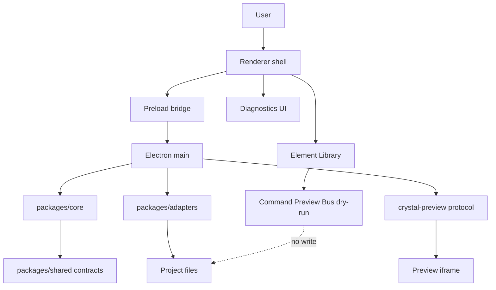

# System Context Diagram

[Docs index](../../README.md)

## Purpose

This diagram shows the current Crystal system context around user actions, renderer UI, main services, core packages, adapters, and project files.

## Current implementation

## Key files

- `apps/desktop/electron/main/main.ts`
- `apps/desktop/electron/preload/bridges/crystal-api.bridge.ts`
- `apps/desktop/electron/renderer/app/bootstrap/bootstrap.ts`
- `packages/core/**`
- `packages/adapters/**`
- `packages/shared/**`

## Data flow

Renderer actions cross the preload bridge before they reach main. Main uses core and adapters. Preview is served through a custom protocol. Command preview remains dry-run.

## Boundaries

Renderer has no direct filesystem access. Command Preview Bus does not apply changes.

## Validation

Covered by runtime, preview, command, and docs validators.

## Related docs

- [System overview](../system-overview.md)
- [Runtime boundaries](./runtime-boundaries.md)
- [Security boundaries](./security-boundaries.md)

## Future work

Add Future worker, WASM, and WebGPU nodes only when their runtime contracts exist.
