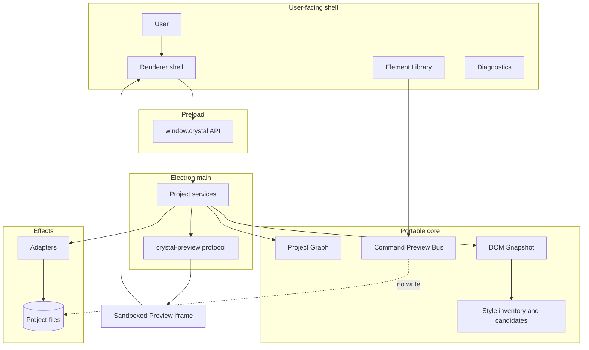

# System context diagram

[Docs index](../../README.md)

## Purpose

This view shows the whole current system on one screen: user-facing shell, constrained bridge, privileged services, portable models, effects, and the isolated Preview page.

## Current implementation

Renderer expresses intent and presents state. Preload exposes named operations. Main owns privileged coordination and Preview protocol serving. Core models Project Graph, DOM Snapshot, selection, Inspector, command previews, and style evidence. Adapters reach project files and watcher/compiler tools.

## Key files

- `apps/desktop/electron/main/main.ts`
- `apps/desktop/electron/preload/bridges/crystal-api.bridge.ts`
- `apps/desktop/electron/renderer/app/bootstrap/bootstrap.ts`
- `packages/core`
- `packages/adapters`

## Data flow

User actions either remain local UI state or cross preload to main. Main selects pure core logic or an adapter effect. Preview serving reaches project files only through root containment. Dry-run command and style models return to renderer without persistence.

## Boundaries

The `Project files` node does not grant every subsystem write access. Current edges to files are read/scan/watch/build effects owned by main/adapters; no command-preview or renderer edge applies mutations.

## Validation

Runtime, Preview, command, style, source-tree, and architecture validators collectively guard the relationships shown.

## Related docs

- [System overview](../system-overview.md)
- [Runtime boundaries diagram](./runtime-boundaries.md)
- [Security boundaries diagram](./security-boundaries.md)

## Future work

Workers, WebGPU, Rust/WASM, and a writer belong in this diagram only after explicit runtime and authority contracts exist.
