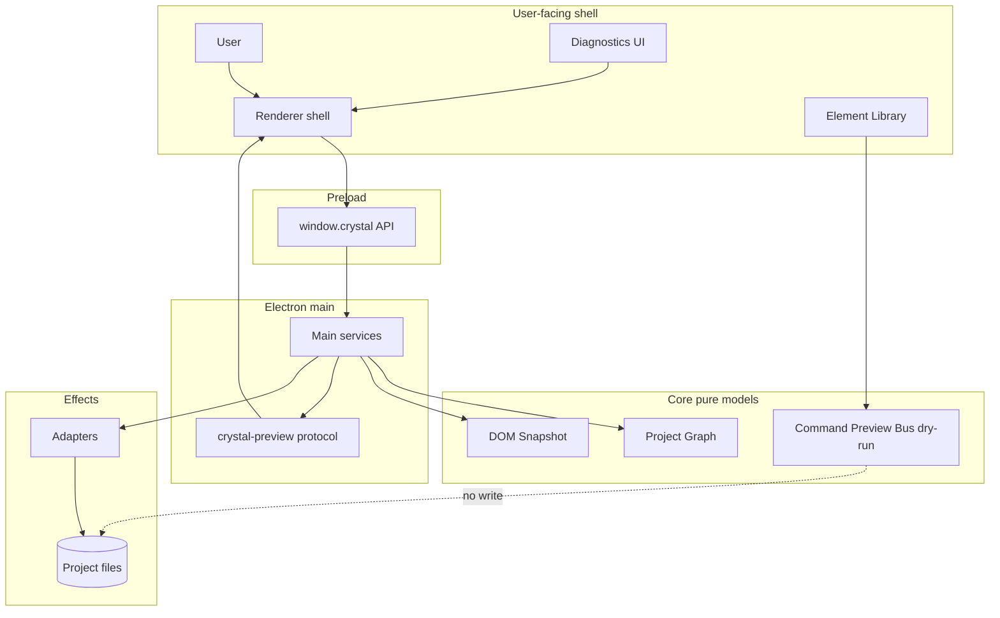

# System Context Diagram

[Docs index](../../README.md)

## At a glance

| Question | Answer |
| --- | --- |
| Is this implemented? | Yes, as documentation of the current system shape. |
| Can this diagram show file writes as current? | No. |
| Runtime owner | Renderer, preload, main, core, adapters, validators. |
| Safety risk controlled | Keeps current dry-run boundary visible. |
| Related next phase | Future write runtime diagrams after contracts exist. |

## Purpose

This diagram gives a one-screen view of Crystal's current system shape. Use it to see which runtime owns which kind of responsibility before reading a specific feature page.

## Why this exists

The system has multiple runtimes and model layers. A context diagram reduces the chance of starting a change from the wrong layer.

## How to read this page

Solid edges are current allowed flows. Dotted edges mark blocked or future-only behavior.

## Current implementation

Renderer presents UI. Preload narrows the bridge. Main owns privileged effects. Core packages model state and dry-run planning. Adapters touch filesystem and watcher effects.

| Implemented | Blocked | Future |
| --- | --- | --- |
| Read-only Preview and dry-run planning. | Command preview writing files. | Write execution runtime. |
| Main-owned filesystem effects. | Renderer direct filesystem access. | Worker/WASM/WebGPU runtimes. |

## Key files

These are entry points for the diagram boxes.

## Key files and responsibilities

| File or path | Responsibility | Reads | Must not do |
| --- | --- | --- | --- |
| `apps/desktop/electron/main/main.ts` | Main startup. | Main modules. | Expose renderer shortcuts. |
| `crystal-api.bridge.ts` | Preload API. | IPC contracts. | Expose raw IPC. |
| `bootstrap.ts` | Renderer startup. | Browser UI modules. | Import main effects. |
| `packages/core/**` | Models/planners. | Pure state. | Perform IO. |
| `packages/adapters/**` | Effects. | Main service calls. | Own UI policy. |

## Data flow

User actions start in renderer, pass through preload when privileged work is needed, reach main services, and use core/adapters depending on whether the work is pure or effectful.

## Main diagram

## Boundaries

Renderer has no direct filesystem access. Command Preview Bus does not apply changes.

## What this does not do

| Not provided | Reason |
| --- | --- |
| Write runtime | Future only. |
| Security proof | Read with security docs. |
| Full source inventory | Use repository map. |

## Common misunderstanding

> **Common misunderstanding:** `Project files` being in the diagram does not mean every subsystem can write to them.

## Validation

Covered by runtime, preview, command, and docs validators.

## Related docs

- [System overview](../system-overview.md)
- [Runtime boundaries](./runtime-boundaries.md)
- [Security boundaries](./security-boundaries.md)

## Future work

Add future worker, WASM, and WebGPU nodes only when their runtime contracts exist.
