# Validation Gates Diagram

[Docs index](../../README.md)

## At a glance

| Question | Answer |
| --- | --- |
| Is this implemented? | Yes, as command graph documentation. |
| Can validation prove future writes exist? | No. |
| Runtime owner | npm scripts and Node validators. |
| Safety risk controlled | Separates docs, structure, preview, UI, and aggregate local gates. |
| Related next phase | More import-boundary and write-runtime checks. |

## Purpose

This diagram shows how documentation and runtime checks fit into the local validation path.

## Why this exists

A docs-only change and a runtime feature change need different evidence. This diagram keeps those gates distinct.

## How to read this page

Use the subgraphs to see which class of validation is being exercised.

## Current implementation

The docs validator runs before the quick build/typecheck gate. It does not prove runtime behavior; it keeps the architecture map and safety language intact.

| Implemented | Blocked | Future |
| --- | --- | --- |
| Docs checks. | Docs replacing runtime validation. | Import-boundary checks. |
| Structure checks. | Validators mutating source. | Write runtime checks. |
| Preview/UI checks. | Future claims as implemented. | Transaction validation. |

## Key files

These files define the validation command graph and docs-specific checks.

## Key files and responsibilities

| File | Responsibility | Reads | Must not do |
| --- | --- | --- | --- |
| `package.json` | Script graph. | Command names. | Add dependencies unnecessarily. |
| `validate-local.mjs` | Aggregate runner. | npm scripts. | Hide failures. |
| `validate-architecture-docs.mjs` | Docs checks. | Markdown docs. | Prove runtime behavior. |
| `validate-source-patch-preview.mjs` | Command preview boundary. | Source files. | Allow writes. |
| `validate-ui-flow.mjs` | Shell UI checks. | Renderer source. | Change runtime. |

## Data flow

Code validation and docs validation are separate static gates. The docs gate checks navigation, sections, Mermaid coverage, roadmap links, and blocked write claims.

## Main diagram

```mermaid
flowchart TD
  subgraph Docs[Docs]
    DocsIndex[docs links]
    Rich[rich Markdown checks]
    Claims[forbidden claims]
  end

  subgraph Structure[Structure]
    Build[build]
    Typecheck[typecheck]
    SourceLayout[validate:structure]
  end

  subgraph Preview[Preview]
    PreviewBase[validate:preview]
    Snapshot[validate:dom-snapshot]
    Selection[validate:preview-selection]
    Inspector[validate:preview-inspector]
  end

  subgraph UIFlow[UI flow]
    Canvas[validate:design-canvas]
    Overlay[validate:visual-selection-overlay]
    Shell[validate:ui-flow]
  end

  subgraph Aggregate[Local aggregate]
    Quick[validate:local:quick]
    Full[validate:local]
  end

  DocsIndex --> Quick
  Rich --> Quick
  Claims --> Quick
  Build --> Quick
  Typecheck --> Quick
  SourceLayout --> Full
  PreviewBase --> Full
  Snapshot --> Full
  Selection --> Full
  Inspector --> Full
  Canvas --> Full
  Overlay --> Full
  Shell --> Full
```

## Boundaries

Docs validation does not replace runtime validation. Runtime validation does not prove future features are implemented.

## What this does not do

| Not provided | Reason |
| --- | --- |
| CI status proof | Local commands and CI are separate. |
| Runtime proof for docs | Docs checks validate docs shape. |
| Auto-repair | Validators fail explicitly. |

## Common misunderstanding

> **Common misunderstanding:** A passing docs validator means the map is coherent, not that runtime behavior changed.

## Validation

Run `npm run validate:architecture-docs` and the normal local validation command appropriate for the branch.

## Related docs

- [Validation system](../validation-system.md)
- [Validation flow](../flows/validation-flow.md)

## Future work

Add import-boundary validation and docs path drift checks after the docs structure stabilizes.
