# Validation gates diagram

[Docs index](../../README.md)

## Purpose

The diagram groups evidence by what it can prove. Documentation coherence, build integrity, runtime boundaries, and feature behavior remain separate checks even when the quick suite runs them together.

## Current implementation

Generated metadata, policy, documentation, build, typecheck, source ownership, feature, UI, watcher, Electron, and validation-platform checks all participate in the canonical strict suite. Required skips fail by default.

```mermaid
flowchart TD
  subgraph Metadata[Metadata and policy]
    ProjectMeta[validate:project-metadata]
    Policy[validate:change-policy]
  end
  subgraph Docs[Documentation]
    Markdown[validate:markdown-integrity]
    Guided[validate:guided-docs]
    Architecture[validate:architecture-docs]
  end
  subgraph Build[Build integrity]
    HTML[build:html]
    SCSS[build:scss]
    TS[build:ts]
    Types[typecheck]
  end
  subgraph Runtime[Runtime and feature]
    Structure[structure and source ownership]
    Preview[Preview pipeline]
    Editing[Editing foundations]
    Style[Style inventory and matching]
    UI[Renderer UI]
  end
  subgraph Environment[Environment]
    Watch[local watch]
    Electron[Electron doctor]
  end
  ProjectMeta --> Quick[validate:local:quick]
  Policy --> Quick
  Markdown --> Quick
  Guided --> Quick
  Architecture --> Quick
  HTML --> Quick
  SCSS --> Quick
  TS --> Quick
  Types --> Quick
  Structure --> Quick
  Preview --> Quick
  Editing --> Quick
  Style --> Quick
  UI --> Quick
  Watch --> Quick
  Electron --> Quick
  Quick -->|all required pass| Pass[PASS]
  Quick -->|failure or required skip| Fail[FAIL]
```

## Key files

- `package.json`
- `scripts/validation/validation-suite.mjs`
- `scripts/validation/validation-runner.mjs`
- `scripts/validation/validation-reporter.mjs`
- `scripts/validate-validation-system.mjs`

## Data flow

Focused checks produce observed status and output. The aggregate runner resolves each required command, executes it, and preserves its result. Renderers may format the report differently but cannot reinterpret status.

## Boundaries

Documentation validation does not prove runtime behavior. Runtime validation does not implement future features. Missing execution cannot become PASS, and validators do not repair the repository.

## Validation

The diagram itself is covered by `validate:architecture-docs`; the platform is covered by `validate:validation-system` and the strict aggregate suite.

## Related docs

- [Validation system](../validation-system.md)
- [Validation flow](../flows/validation-flow.md)
- [Development](../../development.md)

## Future work

Add new gates when a new contract creates testable risk. Keep suite membership and required/optional semantics in the canonical catalog.
