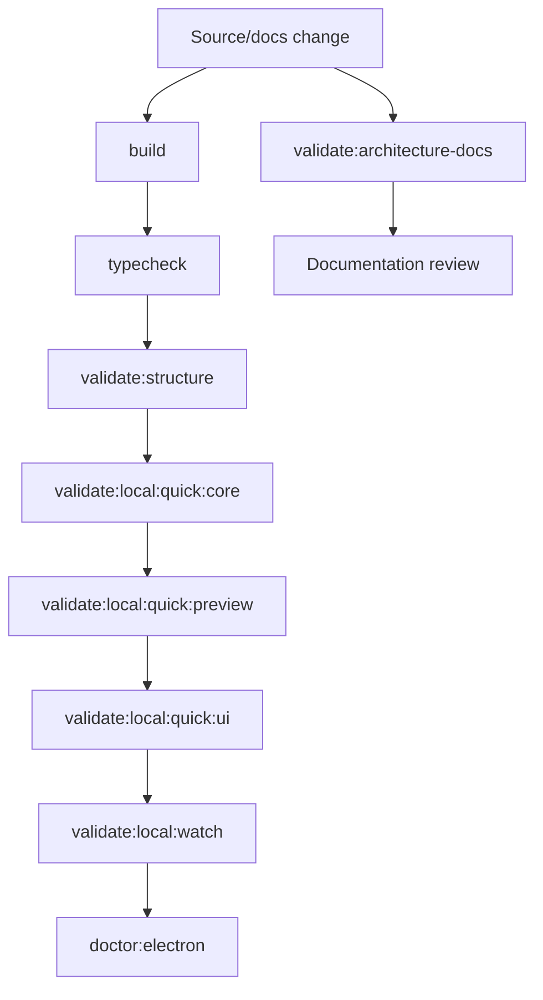

# Validation Gates Diagram

[Docs index](../../README.md)

## Purpose

This diagram shows the current validation sequence and the added documentation validation gate.

## Current implementation

## Key files

- `package.json`
- `scripts/validate-local.mjs`
- `scripts/validate-architecture-docs.mjs`
- `scripts/validate-source-patch-preview.mjs`
- `scripts/validate-ui-flow.mjs`

## Data flow

Code validation and docs validation are separate static gates. The docs gate checks navigation, sections, and Mermaid coverage.

## Boundaries

Docs validation does not replace runtime validation. Runtime validation does not prove future features are implemented.

## Validation

Run `npm run validate:architecture-docs` and the normal local validation command appropriate for the branch.

## Related docs

- [Validation system](../validation-system.md)
- [Validation flow](../flows/validation-flow.md)

## Future work

Add import-boundary validation and docs path drift checks after the docs structure stabilizes.
