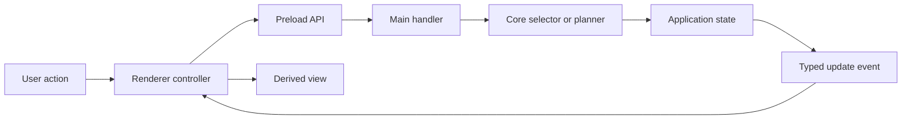

# Event and state flow

[Docs index](../README.md)

## Purpose

Events report state changes; commands request actions. This page shows how Crystal keeps those concepts separate while state crosses renderer, preload, main, and core.

## Current implementation

Implemented domains include Project Graph, watcher, Preview, DOM Snapshot, Preview Selection, Preview Inspector, Design Canvas, external overlay, Element Library, command preview, transaction/readiness previews, disabled Inspector drafts, style inventory, and authored-style candidate matching. Authoritative application state is main/core owned; renderer keeps presentation and local interaction state.

## Key files

- `packages/core/state/app-state.ts`
- `packages/core/events/project-events.ts`
- `packages/core/events/project-preview-events.ts`
- `apps/desktop/electron/main/ipc/project-ipc-state.ts`
- `apps/desktop/electron/renderer/app/bootstrap/bootstrap.ts`

## Data flow

Explicit user actions or watcher batches start a transition. Renderer calls a narrow preload method. Main validates and coordinates. Core derives model or preview state. Main emits typed updates. Renderer re-renders from sanitized state. A displayed preview, readiness summary, or candidate list does not become applied state.

## Boundaries

Commands and events remain different contracts. Renderer-local state must not become the authoritative project model. Dry-run result objects do not mutate Project Graph, Snapshot, Preview, files, or history.

## Validation

Feature validators cover state edges most likely to drift. `validate:validation-system` ensures required checks remain registered and strict reporting semantics remain intact.

## Related docs

- [Commands architecture](./commands/README.md)
- [Preview Selection](./preview/preview-selection.md)
- [Future write flow](./flows/future-write-flow.md)

## Future work

When writes arrive, events should report committed effects after persistence and refresh, not substitute for the command or transaction that performed them.
