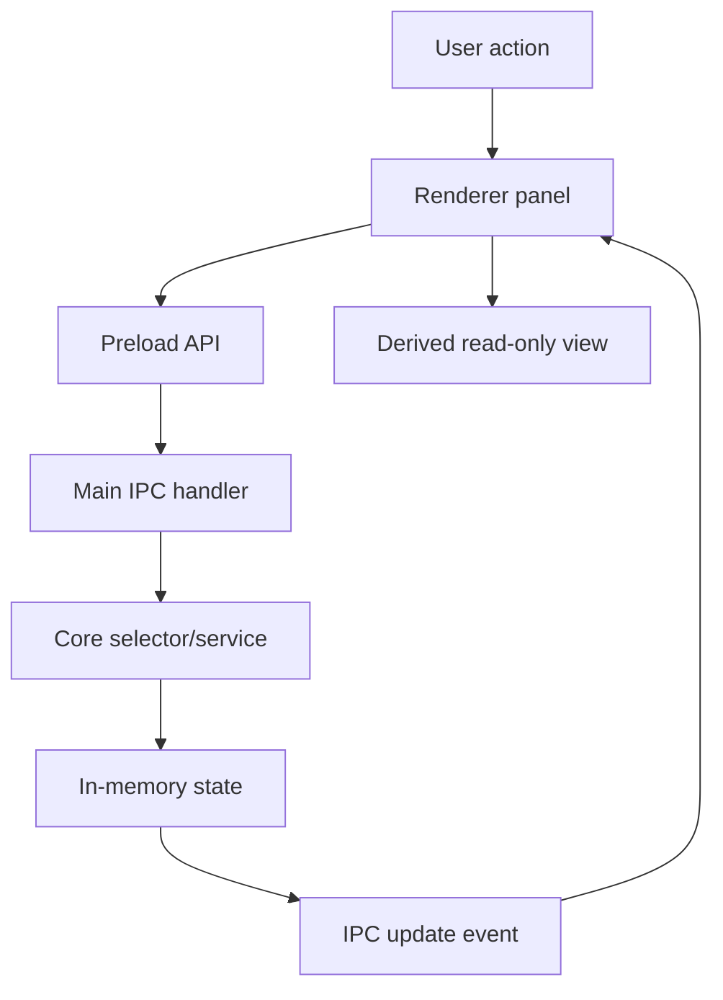

# Event and State Flow

[Docs index](../README.md)

## Purpose

This document explains how state moves through Crystal without giving renderer modules direct authority over privileged operations.

## Current implementation

Current state domains include Project Graph state, watcher state, Preview state, DOM Snapshot state, Preview Selection state, Preview Inspector derived state, Design Canvas viewport state, Element Library panel state, Source Patch Preview result state, and Command Preview Bus result state.

## Key files

- `packages/core/state/app-state.ts`
- `packages/core/state/app-state.types.ts`
- `packages/core/events/project-events.ts`
- `packages/core/events/project-preview-events.ts`
- `apps/desktop/electron/main/ipc/project-ipc-state.ts`
- `apps/desktop/electron/main/ipc/register-project-ipc.ts`
- `apps/desktop/electron/renderer/app/bootstrap/bootstrap.ts`
- `apps/desktop/electron/renderer/components/project-preview-panel/project-preview-panel.ts`

## Data flow

State changes start from explicit user actions or watcher refreshes. The renderer calls a narrow preload API. Main validates and coordinates. Core modules calculate model state or derived results. Main emits update events back to the renderer. Renderer panels store only UI-local state or render from latest sanitized application state.

Preview Inspector is derived, not authoritative. Visual Selection Overlay is also derived: it projects existing selection and snapshot data outside the iframe. Element Library previews are dry-run derived data; they do not mutate Project Graph, DOM Snapshot, Preview state, or files.

## Boundaries

Events report that something changed. Commands request an action. Validators decide whether an action is legal. Source Patch Preview and Command Preview Bus are still dry-run paths. A displayed preview result must not be treated as applied state.

## Validation

Feature validators check that UI state remains read-only where required. `validate:preview-selection`, `validate:preview-inspector`, `validate:visual-selection-overlay`, `validate:html-element-library`, and `validate:source-patch-preview` cover the state edges most likely to drift.

## Related docs

- [Command Preview Bus](./commands/command-preview-bus.md)
- [Source Patch Preview](./commands/source-patch-preview.md)
- [Preview Selection](./preview/preview-selection.md)
- [Visual Selection Overlay](./preview/visual-selection-overlay.md)
- [Future write flow](./flows/future-write-flow.md)

## Future work

Phase 6C should introduce transaction skeletons and refresh-boundary planning as state contracts. It should not introduce an apply path, durable history, real undo/redo, or source mutation.
