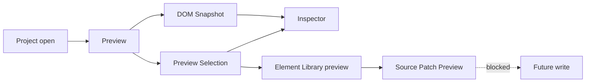

# Architecture Flows

[Docs index](../../README.md)

## Purpose

Flows explain how state crosses module and runtime boundaries. They are useful when a feature touches more than one package, because the correct implementation is usually about the handoff: what enters a subsystem, what decision is made, and what state leaves.

## Current implementation

The implemented flows are read-only or dry-run: project open, Preview load, DOM Snapshot, Preview Selection, Element Library preview, Source Patch Preview, and validation. The future write flow is documented as blocked so the current dry-run paths are not mistaken for execution.

The overview diagram shows the normal path from project open to preview planning. The dashed write edge is intentionally unavailable.

## Key files

Use the flow files to find the relevant implementation entry points. The files below are common crossing points for main, core, and renderer state.

- `apps/desktop/electron/main/ipc/register-project-ipc.ts`
- `apps/desktop/electron/main/ipc/project-scan-service.ts`
- `apps/desktop/electron/main/preview/project-preview-service.ts`
- `apps/desktop/electron/main/dom/project-dom-snapshot-service.ts`
- `apps/desktop/electron/main/preview-selection/project-preview-selection-service.ts`
- `packages/core/commands/html-insertion/**`

## Data flow

Each flow starts with a user action or validation command. Main or core makes the privileged or semantic decision. Renderer receives sanitized state, a defensive state, or a dry-run preview. No current flow ends in project file mutation.

## Boundaries

Flow documentation should never hide the boundary between preview and write. A Source Patch Preview may look like a patch, but it is still display data until a future execution runtime exists.

## Validation

Use this directory with [Validation system](../validation-system.md) and [Validation gates](../diagrams/validation-gates.md).

## Related docs

- [Project open flow](./project-open-flow.md)
- [Preview selection flow](./preview-selection-flow.md)
- [DOM Snapshot flow](./dom-snapshot-flow.md)
- [Future write flow](./future-write-flow.md)

## Future work

Add flow docs when a new feature creates a new cross-runtime path. Do not add flow pages only to increase document count.
