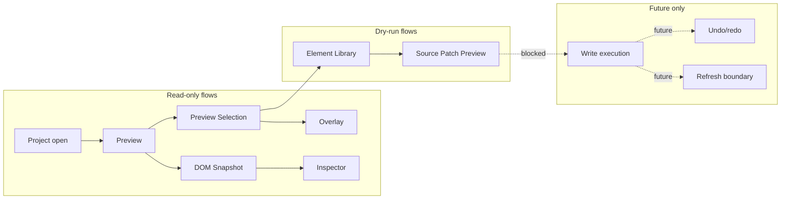

# Architecture Flows

[Docs index](../../README.md)

## At a glance

| Question | Answer |
| --- | --- |
| Is this implemented? | Yes, as procedural documentation for current read-only and dry-run flows. |
| Can any flow write source files? | No. |
| Runtime owner | Flow-dependent: renderer initiates, preload/main/core decide, renderer displays. |
| Safety risk controlled | Prevents hidden side effects across runtime boundaries. |
| Related next phase | Phase 6C future write-flow contracts. |

> **Read this first:** Flow docs are about handoffs. Look for the input, the decision, and the output.

## Purpose

Flows explain how state crosses module and runtime boundaries. They are useful when a feature touches more than one package, because the correct implementation is usually about the handoff.

## Why this exists

Crystal's features rarely live in one file. A click, preview load, or command intent can cross renderer, preload, main, core, validators, and UI. The flow docs keep those crossings explicit.

## How to read this page

| Need | Read |
| --- | --- |
| Project root to Project Graph | [Project open flow](./project-open-flow.md) |
| Iframe click to selection state | [Preview selection flow](./preview-selection-flow.md) |
| Source file to static model | [DOM Snapshot flow](./dom-snapshot-flow.md) |
| Element Library to dry-run result | [Element Library preview flow](./element-library-preview-flow.md) |
| Future write boundary | [Future write flow](./future-write-flow.md) |

## Current implementation

The implemented flows are read-only or dry-run: project open, Preview load, DOM Snapshot, Preview Selection, Element Library preview, Source Patch Preview, and validation. The future write flow is documented as blocked so current dry-run paths are not mistaken for execution.

| Implemented | Blocked | Future |
| --- | --- | --- |
| Read-only project and preview flows. | File writes. | Transaction flow. |
| Dry-run command preview flows. | Patch apply. | Refresh invalidation flow. |
| Validation flow. | DOM mutation. | Save/apply flow. |

## Flow summary

| Step | Actor | Input | Decision | Output |
| --- | --- | --- | --- | --- |
| Open project | Renderer + main | User-selected root/file | Is root valid and scannable? | Project Graph state. |
| Load Preview | Renderer + main | Graph page | Is target safe? | Preview URL or issue. |
| Build Snapshot | Main + core | Active target source | Can parser build bounded tree? | DOM Snapshot state. |
| Select node | Iframe + renderer + core | Bounded click payload | Can it map to snapshot? | Matched or defensive selection. |
| Preview command | Renderer + core | Catalog item + target | Can safe source preview be built? | Source Patch Preview or blocked result. |

## Key files

Use the flow files to find the relevant implementation entry points. The files below are common crossing points for main, core, and renderer state.

## Key files and responsibilities

| File | Responsibility | Reads | Must not do |
| --- | --- | --- | --- |
| `register-project-ipc.ts` | Main IPC wiring. | Shared channels. | Expose write shortcuts. |
| `project-scan-service.ts` | Project scan coordination. | Selected root. | Let renderer scan files. |
| `project-preview-service.ts` | Preview state lifecycle. | Active graph/root. | Serve unsafe targets. |
| `project-dom-snapshot-service.ts` | Snapshot source read. | Active target. | Read iframe DOM. |
| `project-preview-selection-service.ts` | Selection state update. | Bounded payload. | Trust ambiguous mapping. |
| `packages/core/commands/html-insertion/**` | Dry-run command planning. | Command + context. | Apply patches. |

## Data flow

Each flow starts with a user action or validation command. Main or core makes the privileged or semantic decision. Renderer receives sanitized state, a defensive state, or a dry-run preview. No current flow ends in project file mutation.

## Main diagram

## Failure and blocked states

| State | Why it happens | What Crystal does |
| --- | --- | --- |
| Missing project root | User has not opened a project. | Shows empty or setup state. |
| Unsafe Preview target | Path is not active-root contained. | Blocks and emits sanitized issue. |
| Stale snapshot | Snapshot no longer matches target context. | Prevents trusted mapping. |
| Unsupported command | Bus does not support command type. | Returns unsupported result. |
| Future write request | No write runtime exists. | Keeps action unavailable. |

## Boundaries

Flow documentation should never hide the boundary between preview and write. A Source Patch Preview may look like a patch, but it is still display data until a future execution runtime exists.

## What this does not do

| Not provided | Reason |
| --- | --- |
| Source mutation | No flow currently owns write execution. |
| Patch application | Current flows stop at preview. |
| Real undo/redo | Transaction records do not exist. |

## Common misunderstanding

> **Common misunderstanding:** A flow that reaches Source Patch Preview has not reached a write path.

## Validation

Use this directory with [Validation system](../validation-system.md) and [Validation gates](../diagrams/validation-gates.md).

## Related docs

- [Project open flow](./project-open-flow.md)
- [Preview selection flow](./preview-selection-flow.md)
- [DOM Snapshot flow](./dom-snapshot-flow.md)
- [Future write flow](./future-write-flow.md)

## Future work

Add flow docs when a new feature creates a new cross-runtime path. Do not add flow pages only to increase document count.
