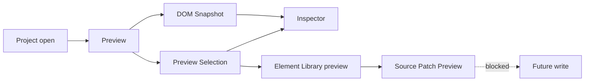

# Architecture Flows

[Docs index](../../README.md)

## Purpose

This hub links the implemented and future Crystal flows that developers should understand before Phase 6C.

## Current implementation

Implemented flows are read-only or dry-run: project open, Preview load, DOM Snapshot, Preview Selection, Element Library preview, Source Patch Preview, and validation. The future write flow is documented as blocked.

## Key files

- `apps/desktop/electron/main/ipc/register-project-ipc.ts`
- `apps/desktop/electron/main/ipc/project-scan-service.ts`
- `apps/desktop/electron/main/preview/project-preview-service.ts`
- `apps/desktop/electron/main/dom/project-dom-snapshot-service.ts`
- `apps/desktop/electron/main/preview-selection/project-preview-selection-service.ts`
- `packages/core/commands/html-insertion/**`

## Data flow

Each flow starts from a user action or validation command, crosses explicit boundaries, and ends in sanitized state, read-only UI, or a blocked Future state.

## Boundaries

Flow documentation must not imply real write behavior. Current command flows end at previews.

## Validation

Use this directory with [Validation system](../validation-system.md) and [Validation gates](../diagrams/validation-gates.md).

## Related docs

- [Project open flow](./project-open-flow.md)
- [Preview selection flow](./preview-selection-flow.md)
- [DOM Snapshot flow](./dom-snapshot-flow.md)
- [Future write flow](./future-write-flow.md)

## Future work

Add new flow docs when a subsystem adds new cross-runtime behavior.
