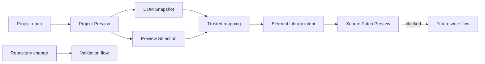

# Architecture flows

[Docs index](../../README.md)

## Purpose

Flow pages follow a request through ownership boundaries. Use them when a feature spans renderer, preload, main, core, adapters, or the Preview iframe and a directory map no longer explains the behavior.

## Current implementation

Implemented flows are read-only or dry-run: project open, DOM Snapshot, Preview Selection, Element Library preview, Source Patch Preview, and validation. The future write flow records the missing lifecycle explicitly. No current flow ends with project source mutation.

## Key files

- `apps/desktop/electron/main/ipc/register-project-ipc.ts`
- `apps/desktop/electron/main/project/project-scan-service.ts`
- `apps/desktop/electron/main/preview/project-preview-service.ts`
- `apps/desktop/electron/main/dom/project-dom-snapshot-service.ts`
- `apps/desktop/electron/main/preview-selection/project-preview-selection-service.ts`
- `packages/core/commands/html-insertion`

## Data flow

A flow starts with user intent, filesystem observation, or a validation command. Renderer expresses intent. Main owns privileged decisions. Core derives semantic state or a dry-run result. Adapters perform allowed effects. Renderer receives sanitized, defensive, or display-only output.

## Boundaries

A flow diagram must show where authority stops. Source Patch Preview is the end of the current editing-like path, not a hidden edge into persistence. Future nodes and dotted arrows are not current implementation.

## Validation

Read each flow with the feature validator named on that page. Use [Validation flow](./validation-flow.md) to choose aggregate evidence.

## Related docs

- [Project open flow](./project-open-flow.md)
- [DOM Snapshot flow](./dom-snapshot-flow.md)
- [Preview Selection flow](./preview-selection-flow.md)
- [Element Library preview flow](./element-library-preview-flow.md)
- [Future write flow](./future-write-flow.md)

## Future work

Add a new flow page only when a feature creates a new causal path or authority crossing. Do not multiply pages for local implementation detail.
