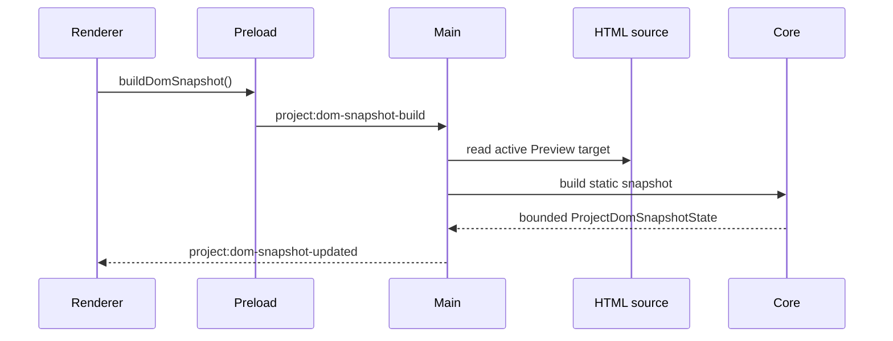

# DOM Snapshot Flow

[Docs index](../../README.md)

## Purpose

DOM Snapshot flow explains how Crystal builds a structural model from source instead of from the iframe. It is the flow that lets the rest of the system reason about source-adjacent structure without relaxing Preview isolation.

## Current implementation

Renderer asks main to build a snapshot for the active Preview target. Main reads the static HTML source. Core parses the source into a bounded tree and returns a sanitized `ProjectDomSnapshotState`.

The sequence shows one important constraint: the iframe is not involved in snapshot construction.

## Key files

These files show the source read, parser, state model, and renderer consumer.

- `apps/desktop/electron/main/dom/project-dom-snapshot-service.ts`
- `packages/core/project/dom/project-dom-snapshot-builder.ts`
- `packages/core/project/dom/project-dom-snapshot-parser.ts`
- `packages/core/project/dom/project-dom-snapshot.types.ts`
- `apps/desktop/electron/renderer/components/project-dom-tree-panel/project-dom-tree-panel.ts`

## Data flow

The active Preview target chooses the source file. The builder serializes a document root and child nodes with paths, text previews, attributes, source locations, truncation flags, and parser issues. Renderer panels consume the emitted state.

## Boundaries

The flow reads source, not runtime DOM. It does not execute scripts or compute layout. Parser recovery is intentionally limited so incorrect confidence does not leak into source planning.

## Validation

`validate:dom-snapshot` verifies snapshot shape, limits, paths, parser issues, and read-only rendering assumptions.

## Related docs

- [DOM Snapshot](../preview/dom-snapshot.md)
- [Preview Selection flow](./preview-selection-flow.md)
- [Source Patch Preview flow](./source-patch-preview-flow.md)

## Future work

More precise source mapping should come before source writes. Worker or WASM acceleration remains future and should preserve the same output contract.
