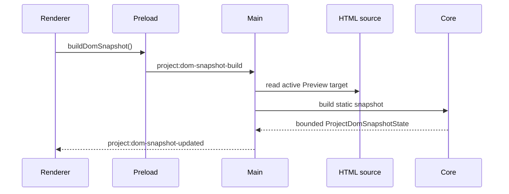

# DOM Snapshot Flow

[Docs index](../../README.md)

## Purpose

This document explains how Crystal builds a static DOM Snapshot from the active Preview target.

## Current implementation

DOM Snapshot is requested from renderer, resolved in main against the current Preview target, built in core from static HTML source, then emitted back to renderer as bounded state.

## Key files

- `apps/desktop/electron/main/dom/project-dom-snapshot-service.ts`
- `packages/core/project/dom/project-dom-snapshot-builder.ts`
- `packages/core/project/dom/project-dom-snapshot-parser.ts`
- `packages/core/project/dom/project-dom-snapshot.types.ts`
- `apps/desktop/electron/renderer/components/project-dom-tree-panel/project-dom-tree-panel.ts`

## Data flow

The active Preview target determines the source file. Snapshot builder serializes a document root and child nodes with paths, text previews, attributes, source locations, truncation flags, and parser issues. Renderer panels consume the resulting state.

## Boundaries

The flow reads source, not iframe runtime DOM. It does not execute scripts or compute layout. Parser recovery is intentionally limited and issue-driven.

## Validation

`validate:dom-snapshot` verifies snapshot shape, limits, paths, parser issues, and read-only rendering assumptions.

## Related docs

- [DOM Snapshot](../preview/dom-snapshot.md)
- [Preview Selection flow](./preview-selection-flow.md)
- [Source Patch Preview flow](./source-patch-preview-flow.md)

## Future work

Source mapping should become more accurate before source writes are enabled. Worker or WASM acceleration remains Future.
