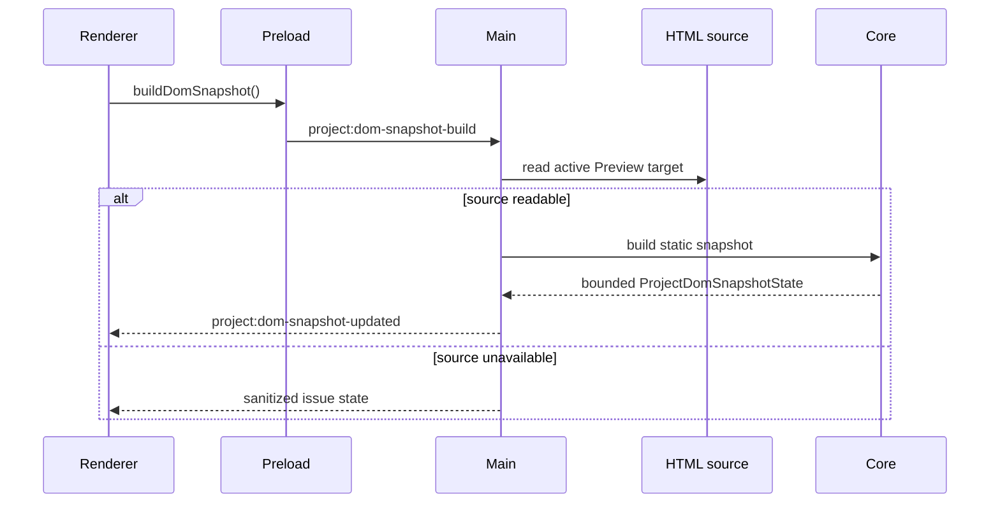

# DOM Snapshot Flow

[Docs index](../../README.md)

## At a glance

| Question | Answer |
| --- | --- |
| Is this implemented? | Yes. |
| Can it inspect live iframe DOM? | No. |
| Runtime owner | Main reads source; core builds snapshot. |
| Safety risk controlled | Keeps source reasoning separate from browser runtime DOM. |
| Related next phase | More precise source mapping. |

## Purpose

DOM Snapshot flow explains how Crystal builds a structural model from source instead of from the iframe.

## Why this exists

Other features need a source-derived structure for mapping and preview planning. Reading the live iframe would undermine Preview isolation.

## How to read this page

Follow the flow summary from active target to consumers, then review blocked states for parser/source limits.

## Current implementation

Renderer asks main to build a snapshot for the active Preview target. Main reads the static HTML source. Core parses the source into a bounded tree and returns sanitized state.

| Implemented | Blocked | Future |
| --- | --- | --- |
| Static source read. | Live iframe DOM read. | Improved parser/source locations. |
| Bounded tree. | Script execution. | Worker/WASM parser. |
| Issue/truncation reporting. | Layout/style computation. | Richer mapping diagnostics. |

## Flow summary

| Step | Actor | Input | Decision | Output |
| --- | --- | --- | --- | --- |
| 1 | Renderer | Build snapshot request | Is Preview target available? | Main IPC request. |
| 2 | Main | Active target | Can source be read? | Source text or issue. |
| 3 | Core | Source text | Can bounded parse complete? | Snapshot tree. |
| 4 | Core | Parser limits | Was data truncated or invalid? | Issues/truncation flags. |
| 5 | Renderer | Snapshot state | Which panels consume it? | DOM Tree, mapping, Inspector, planner. |

## Key files

These files show the source read, parser, state model, and renderer consumer.

## Key files and responsibilities

| File | Responsibility | Reads | Must not do |
| --- | --- | --- | --- |
| `project-dom-snapshot-service.ts` | Main source read. | Active Preview target. | Read iframe DOM. |
| `project-dom-snapshot-parser.ts` | Static parser. | HTML source. | Execute scripts. |
| `project-dom-snapshot-builder.ts` | Tree builder. | Parser records. | Write files. |
| `project-dom-tree-panel.ts` | UI display. | Snapshot state. | Mutate source. |

## Data flow

The active Preview target chooses the source file. The builder serializes a document root and child nodes with paths, text previews, attributes, source locations, truncation flags, and parser issues.

## Main diagram

## Failure and blocked states

| State | Why it happens | What Crystal does |
| --- | --- | --- |
| No target | Preview not loaded. | Shows unavailable state. |
| Read failure | Source cannot be read. | Reports sanitized issue. |
| Parser issue | HTML malformed or limited. | Keeps issue with snapshot. |
| Missing source location | Parser cannot map exact source. | Blocks source patch preview when needed. |

## Boundaries

The flow reads source, not runtime DOM. It does not execute scripts or compute layout.

## What this does not do

| Not provided | Reason |
| --- | --- |
| Live DOM sync | Would trust runtime DOM. |
| CSS cascade | Style Engine future. |
| Source write | Snapshot is read-only. |

## Common misunderstanding

> **Common misunderstanding:** A snapshot node is useful for reasoning, but it is not an editable DOM object.

## Validation

`validate:dom-snapshot` verifies snapshot shape, limits, paths, parser issues, and read-only rendering assumptions.

## Related docs

- [DOM Snapshot](../preview/dom-snapshot.md)
- [Preview Selection flow](./preview-selection-flow.md)
- [Source Patch Preview flow](./source-patch-preview-flow.md)

## Future work

More precise source mapping should come before source writes. Worker or WASM acceleration remains future and should preserve the same output contract.
