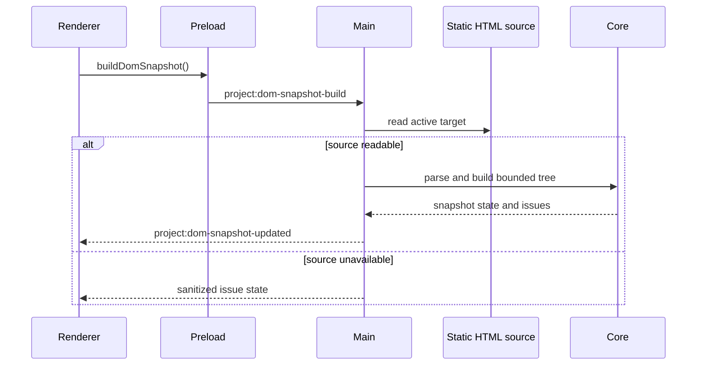

# DOM Snapshot flow

[Docs index](../../README.md)

## Purpose

This flow shows how the active HTML source becomes a bounded structural model without treating the Preview iframe as a data source.

## Current implementation

Renderer requests a snapshot for the active Preview target. Main resolves and reads the static HTML file. Core parses and builds bounded state, including issues and truncation. Main publishes the result to DOM Tree, selection mapping, Inspector, source-anchor, and authored-style consumers.

## Key files

- `apps/desktop/electron/main/dom/project-dom-snapshot-service.ts`
- `packages/core/project/dom/project-dom-snapshot-parser.ts`
- `packages/core/project/dom/project-dom-snapshot-builder.ts`
- `packages/core/project/dom/project-dom-snapshot.types.ts`
- `components/project-dom-tree-panel/project-dom-tree-panel.ts`

## Data flow

The Preview target chooses the source file. Parser limits bound depth, nodes, attributes, and text previews. Source locations are attached when available. Missing location remains explicit because later source-anchor planning must block rather than guess.

## Boundaries

The flow reads static source only. It does not inspect the live iframe DOM, execute scripts, compute layout or styles, synchronize runtime mutations, or write files.

## Validation

`npm run validate:dom-snapshot` checks parser limits, paths, source locations, malformed input, truncation, issue state, and read-only UI assumptions.

## Related docs

- [DOM Snapshot](../preview/dom-snapshot.md)
- [Preview Selection flow](./preview-selection-flow.md)
- [Source Patch Preview flow](./source-patch-preview-flow.md)

## Future work

More precise ranges or a worker/WASM implementation must preserve the same plain bounded output and failure model.
