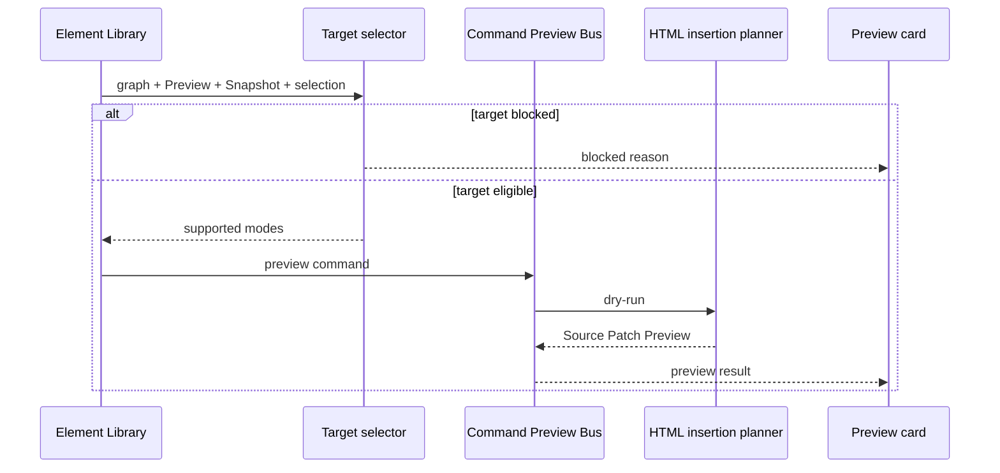

# Element Library preview flow

[Docs index](../../README.md)

## Purpose

This is the closest current user flow to editing. It shows how catalog intent reaches a source preview while keeping the unavailable Apply boundary visible.

## Current implementation

Renderer combines the selected catalog item and insertion mode with Project Graph, Preview, DOM Snapshot, and trusted selection state. Core target selectors decide eligibility. The Command Preview Bus routes a supported request to the HTML insertion planner. Renderer displays preview-ready, blocked, unsupported, or neutral state.

## Key files

- `components/html-element-library-panel/html-element-library-panel.ts`
- `components/html-element-library-panel/insertion-mode-picker.renderer.ts`
- `components/html-element-library-panel/command-preview.renderer.ts`
- `packages/core/project/html-element-library/insertion-target.selectors.ts`
- `packages/core/commands/command-preview-bus/command-preview-bus.preview.ts`

## Data flow

Target eligibility normalizes current context before a command is created. Missing selection, stale mapping, unavailable source location, or unsupported mode becomes an explanatory result. A successful preview contains display data and leaves Apply unavailable.

## Boundaries

The flow does not insert HTML, mutate the iframe, apply a patch, call write IPC, create executable history, or refresh project state.

## Validation

`validate:html-element-library` covers catalog and eligibility. `validate:source-patch-preview` covers dry-run routing, source anchors, preview rendering, and the blocked write edge.

## Related docs

- [HTML Element Library](../commands/html-element-library.md)
- [Command Preview Bus](../commands/command-preview-bus.md)
- [Source Patch Preview flow](./source-patch-preview-flow.md)

## Future work

When execution exists, this flow should hand a validated preview into a separate transaction lifecycle rather than gaining local Apply behavior.
