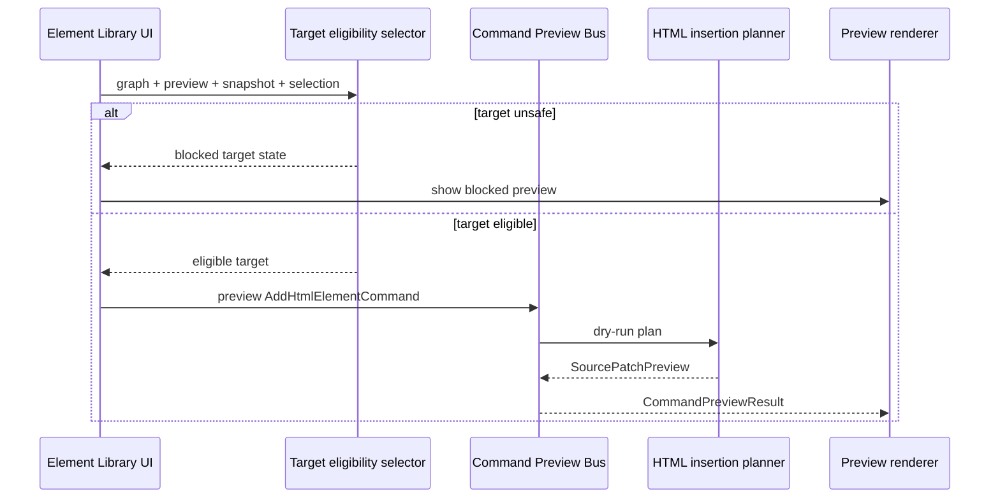

# Element Library Preview Flow

[Docs index](../../README.md)

## At a glance

| Question | Answer |
| --- | --- |
| Is this implemented? | Yes, as dry-run preview flow. |
| Can it insert elements? | No. |
| Runtime owner | Renderer creates intent; core validates and previews. |
| Safety risk controlled | Prevents a catalog action from bypassing source mapping and history requirements. |
| Related next phase | Phase 6C transaction planning. |

## Purpose

Element Library preview flow shows how UI intent becomes a dry-run command preview. This is the closest current flow to editing, so the blocked write boundary must be explicit.

## Why this exists

The user needs feedback before future insertion exists. The flow gives useful preview state while avoiding hidden mutation.

## How to read this page

Use the flow summary to see how graph, preview, snapshot, and selection context become command preview input.

## Current implementation

The flow needs a selected catalog item, insertion mode, active Project Graph, loaded Preview target, DOM Snapshot state, and a matched Preview Selection target. If those inputs are not trustworthy, the result is defensive or blocked.

| Implemented | Blocked | Future |
| --- | --- | --- |
| Catalog selection. | Insert operation. | Apply command. |
| Target eligibility. | Patch apply. | Transaction history. |
| Dry-run preview. | Write IPC. | Refresh invalidation. |

## Flow summary

| Step | Actor | Input | Decision | Output |
| --- | --- | --- | --- | --- |
| 1 | Renderer | Catalog item | Is item supported? | Command intent. |
| 2 | Renderer/core | Graph + Preview + Snapshot + Selection | Is target eligible? | Eligible target or blocked reason. |
| 3 | Core | Command + target | Is command previewable? | Preview result. |
| 4 | Renderer | Preview result | How should state be displayed? | Preview card. |
| 5 | Renderer | Apply affordance | Is execution available? | Disabled/future-only. |

## Key files

These files cover UI intent, target eligibility, command preview, and rendering.

## Key files and responsibilities

| File | Responsibility | Reads | Must not do |
| --- | --- | --- | --- |
| `html-element-library-panel.ts` | UI intent state. | Catalog and current context. | Insert elements. |
| `insertion-mode-picker.renderer.ts` | Insertion mode UI. | Eligibility state. | Enable unsupported modes. |
| `command-preview.renderer.ts` | Preview display. | CommandPreviewResult. | Apply patch. |
| `insertion-target.selectors.ts` | Target eligibility. | Graph, Preview, Snapshot, Selection. | Trust ambiguous mapping. |
| `command-preview-bus.preview.ts` | Dry-run preview route. | Command + context. | Execute command. |

## Data flow

The UI normalizes insertion mode against target eligibility, creates an `AddHtmlElementCommand` preview object, and sends it to core preview planning. Core returns blocked, unsupported, or preview-ready state.

## Main diagram

## Failure and blocked states

| State | Why it happens | What Crystal does |
| --- | --- | --- |
| No catalog item | User has not selected one. | Shows neutral preview state. |
| No matched target | Selection missing or defensive. | Blocks preview. |
| Unsupported mode | Target cannot receive before/after/inside preview. | Disables or blocks mode. |
| Apply unavailable | Execution runtime does not exist. | Keeps action disabled. |

## Boundaries

This flow does not write HTML. The Apply action remains unavailable. No source write IPC is called.

## What this does not do

| Not provided | Reason |
| --- | --- |
| Active insertion | Future execution runtime. |
| DOM mutation | Preview is isolated. |
| Patch application | Dry-run only. |

## Common misunderstanding

> **Common misunderstanding:** A visible preview card is not an applied change.

## Validation

`validate:html-element-library` and `validate:source-patch-preview` cover this flow.

## Related docs

- [HTML Element Library](../commands/html-element-library.md)
- [Command Preview Bus](../commands/command-preview-bus.md)
- [Source Patch Preview](../commands/source-patch-preview.md)

## Future work

Phase 6C should connect this flow to transaction and refresh-boundary contracts while still keeping patch application blocked.
