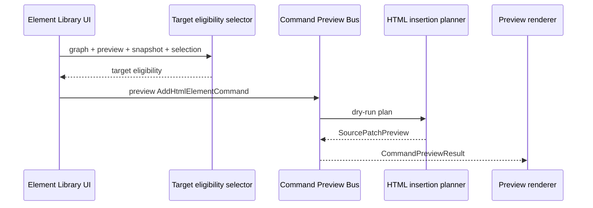

# Element Library Preview Flow

[Docs index](../../README.md)

## Purpose

Element Library preview flow shows how UI intent becomes a dry-run command preview. This is the closest current flow to editing, so it is also where the blocked write boundary must be most explicit.

## Current implementation

The flow needs a selected catalog item, insertion mode, active Project Graph, loaded Preview target, DOM Snapshot state, and a matched Preview Selection target. If those inputs are not trustworthy, the result is defensive or blocked.

The sequence shows that eligibility is checked before the command preview bus receives intent.

## Key files

These files cover UI intent, target eligibility, command preview, and rendering.

- `apps/desktop/electron/renderer/components/html-element-library-panel/html-element-library-panel.ts`
- `apps/desktop/electron/renderer/components/html-element-library-panel/renderers/insertion-mode-picker.renderer.ts`
- `apps/desktop/electron/renderer/components/html-element-library-panel/renderers/command-preview.renderer.ts`
- `packages/core/project/html-element-library/insertion-target.selectors.ts`
- `packages/core/commands/html-insertion/html-insertion-command.preview.ts`
- `packages/core/commands/command-preview-bus/command-preview-bus.preview.ts`

## Data flow

The UI normalizes insertion mode against target eligibility, creates an `AddHtmlElementCommand` preview object, and sends it to core preview planning. Core returns blocked, unsupported, or preview-ready state. Renderer displays that state without storing it as a project mutation.

## Boundaries

This flow does not write HTML. The Apply action remains unavailable. No source write IPC is called. A preview result is explanatory state, not project state.

## Validation

`validate:html-element-library` and `validate:source-patch-preview` cover this flow.

## Related docs

- [HTML Element Library](../commands/html-element-library.md)
- [Command Preview Bus](../commands/command-preview-bus.md)
- [Source Patch Preview](../commands/source-patch-preview.md)

## Future work

Phase 6C should connect this flow to transaction and refresh-boundary contracts while still keeping patch application blocked.
