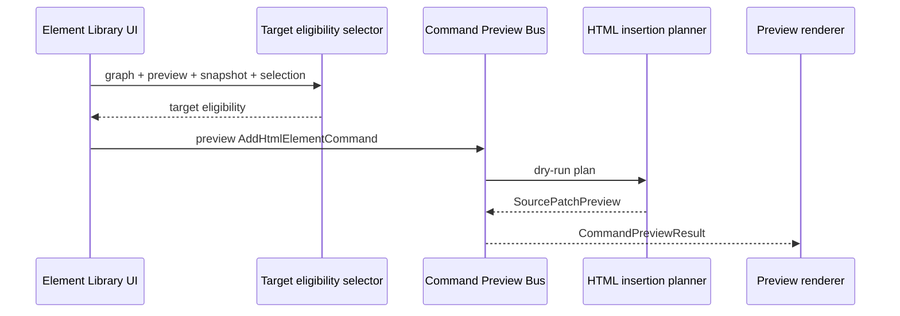

# Element Library Preview Flow

[Docs index](../../README.md)

## Purpose

This document describes how a selected Element Library item becomes a read-only command preview.

## Current implementation

The flow starts in renderer and ends at a dry-run `CommandPreviewResult`. It requires a selected catalog item, insertion mode, active Project Graph, loaded Preview target, DOM Snapshot state, and a matched Preview Selection target.

## Key files

- `apps/desktop/electron/renderer/components/html-element-library-panel/html-element-library-panel.ts`
- `apps/desktop/electron/renderer/components/html-element-library-panel/renderers/insertion-mode-picker.renderer.ts`
- `apps/desktop/electron/renderer/components/html-element-library-panel/renderers/command-preview.renderer.ts`
- `packages/core/project/html-element-library/insertion-target.selectors.ts`
- `packages/core/commands/html-insertion/html-insertion-command.preview.ts`
- `packages/core/commands/command-preview-bus/command-preview-bus.preview.ts`

## Data flow

The UI normalizes insertion mode against current target eligibility. It creates a preview command only for display. Core returns blocked, unsupported, or preview-ready states. The renderer shows a status badge, human summary, and short inserted text preview when available.

## Boundaries

The flow does not write HTML. The Apply button remains unavailable. The renderer does not call any source write IPC. The preview result is not stored as project state.

## Validation

`validate:html-element-library` and `validate:source-patch-preview` cover the flow.

## Related docs

- [HTML Element Library](../commands/html-element-library.md)
- [Command Preview Bus](../commands/command-preview-bus.md)
- [Source Patch Preview](../commands/source-patch-preview.md)

## Future work

Phase 6C should connect this flow to transaction skeleton and refresh planning contracts, still without applying patches.
