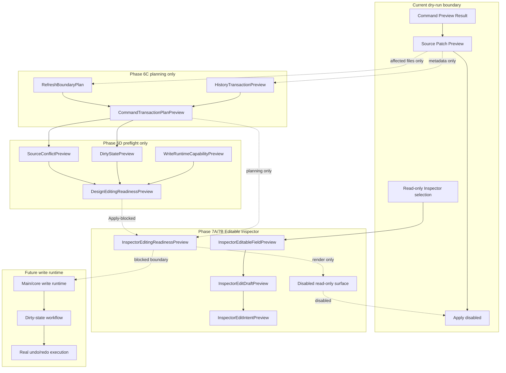

# Future Write Flow

[Docs index](../../README.md)

## At a glance

| Question | Answer |
| --- | --- |
| Is this implemented? | No write runtime is implemented. |
| Can any current flow write source files? | No. |
| Runtime owner | Future main/core write services. |
| Phase 6C status | Planning contracts only. |
| Phase 6D status | Design editing preflight/readiness contracts only. |
| Phase 7A status | Editable Inspector draft/intent foundation only. |
| Phase 7B status | Editable Inspector read-only draft surface only. |
| Safety risk controlled | Prevents dry-run preview, transaction planning, editing readiness, Inspector edit intent, and disabled Inspector controls from being mistaken for mutation. |

> **Future-only:** Everything after the blocked write boundary is planning language, not available behavior.

## Purpose

Future write flow documents the path Crystal should eventually take to modify source files. Phase 6C adds planning models that make the missing write boundary explicit: a command preview may be associated with a transaction preview and a refresh-boundary plan, but that association is still descriptive only. Phase 6D adds preflight/readiness models for a future Design Editing MVP without crossing into persistence, patch application, write IPC, or Apply enablement. Phase 7A adds Editable Inspector draft/intent foundation models for text and attribute edits, still without writing or mutating anything. Phase 7B renders those models as a disabled/read-only Inspector surface.

## Why this exists

A future editor needs a reversible write path. The current application has Source Patch Preview and dry-run command previews, so the codebase now needs planning contracts and disabled surfaces that describe history, refresh, design readiness, and Inspector edit intent without crossing into persistence.

## How to read this page

| Need | Read |
| --- | --- |
| Current truth | Current implementation and boundaries. |
| Phase 6C addition | Planning-only models. |
| Phase 6D addition | Preflight/readiness-only models. |
| Phase 7A addition | Inspector draft/intent-only models. |
| Phase 7B addition | Inspector read-only disabled surface. |
| Future writing | Future write runtime and future work. |

## Current implementation

There is no implemented write flow. No file is modified. No DOM node is inserted. No patch is applied. No write IPC exists. No undo/redo transaction is executed. Current Element Library, Source Patch Preview, Command Preview Bus, Phase 6C transaction planning, Phase 6D design editing preflight, Phase 7A Editable Inspector draft/intent foundation, and Phase 7B Editable Inspector read-only draft surface flows stop at dry-run preview, planning, readiness, intent descriptors, or disabled controls.

Phase 6D boundary: No source files are written. No patch apply is available. No write IPC exists. Apply remains unavailable. No undo/redo execution runs. Dirty-state is not persisted. No refresh execution runs. No Preview DOM mutation occurs.

Phase 7A boundary: Editable Inspector draft/intent foundation only. No source files are written. No patch apply is available. No write IPC exists. Apply remains unavailable. No contenteditable is used. No undo/redo execution runs. Dirty-state is not persisted. No refresh execution runs. No Preview DOM mutation occurs.

Phase 7B boundary: Editable Inspector read-only draft surface only. No source files are written. No patch apply is available. No write IPC exists. Apply remains unavailable. No contenteditable is used. No undo/redo execution runs. Dirty-state is not persisted. No refresh execution runs. No Preview DOM mutation occurs.

| Implemented | Blocked | Future |
| --- | --- | --- |
| Dry-run command preview. | File write. | Explicit write runtime. |
| Source Patch Preview. | Patch apply. | Atomic patch application. |
| History transaction preview model. | Real undo/redo. | Durable history log. |
| Refresh boundary planning model. | Refresh execution after writes. | Dirty-state/save workflow. |
| Design editing readiness preview. | Apply enablement. | Gated Apply/Save flow. |
| Inspector edit draft/intent previews. | Applied Inspector edits. | Gated Inspector Apply flow. |
| Disabled Editable Inspector surface. | Editable field mutation. | Gated Inspector Apply flow. |
| Disabled Apply affordance. | Write IPC. | Gated Apply/Save flow. |

## Key files

These are current dry-run, planning, readiness, draft/intent, and read-only surface files only. Do not use them as evidence of write support.

## Key files and responsibilities

| File or path | Responsibility today | Reads | Must not do |
| --- | --- | --- | --- |
| `packages/core/commands/command-preview-bus/**` | Dry-run routing. | Command preview input. | Execute command. |
| `packages/core/source-patch/**` | Preview anchor and source patch payload. | Snapshot source location. | Persist files. |
| `packages/core/history/**` | Transaction preview descriptor. | Source Patch Preview metadata. | Execute undo/redo. |
| `packages/core/refresh-boundary/**` | Future invalidation descriptor. | Affected file list. | Reload Preview or mutate state. |
| `packages/core/commands/transaction-planning/**` | Joins command preview, source patch, history, and refresh descriptors. | Preview-only models. | Apply patches. |
| `packages/core/dirty-state/**` | Models unsaved-change state before persistence. | Transaction and patch preview IDs. | Persist dirty state. |
| `packages/core/source-conflict/**` | Models source freshness preconditions. | Version metadata only. | Read or hash files. |
| `packages/core/write-runtime/**` | States that write capability is absent. | Missing capability list. | Create a write runtime. |
| `packages/core/design-editing/**` | Summarizes readiness and blocked Apply state. | Preview-only contracts. | Enable Apply. |
| `packages/core/inspector-editing/**` | Models future Inspector fields, drafts, intents, readiness, and read-only surface view model. | Selection path and source-location availability. | Mutate DOM or write source. |
| `apps/desktop/electron/renderer/views/inspector/editable-inspector/**` | Displays disabled Inspector draft surface. | Inspector editing view model. | Enable editing or Apply. |
| `html-element-library-panel/**` | Displays intent and preview. | Preview result. | Enable active Apply. |

Future write execution files do not exist yet.

## Data flow

| Step | Current or future | Input | Output |
| --- | --- | --- | --- |
| 1 | Current | Command Preview Result | Dry-run status. |
| 2 | Current | Source Patch Preview | Affected file and reversibility metadata. |
| 3 | Phase 6C | Source Patch Preview metadata | `HistoryTransactionPreview`. |
| 4 | Phase 6C | Affected files | `RefreshBoundaryPlan`. |
| 5 | Phase 6C | Command + patch + history + refresh descriptors | `CommandTransactionPlanPreview`. |
| 6 | Phase 6D | Transaction plan plus preflight inputs | `DesignEditingReadinessPreview` with `applyAvailable: false`. |
| 7 | Phase 7A | Preview Inspector selection, draft field values, and edit intents | `InspectorEditingReadinessPreview` with `applyAvailable: false`. |
| 8 | Phase 7B | InspectorEditingReadinessPreview and draft fields | Disabled/read-only Inspector surface. |
| 9 | Future | Validated transaction | Write, refresh, dirty-state, and real history execution. |

## Boundaries

Phase 6C models are planning-only. They must not write files, apply patches, add IPC write channels, enable Apply, mutate iframe DOM, reload Preview, clear actual selection state, persist dirty state, or claim actual insertion.

Phase 6D models are preflight-only. They must not write files, apply patches, add IPC write channels, enable Apply, mutate iframe DOM, reload Preview, clear actual selection state, persist dirty state, or claim actual insertion.

Phase 7A models are draft/intent-only. They must not write files, apply patches, add IPC write channels, enable Apply, use contenteditable, mutate iframe DOM, reload Preview, clear actual selection state, persist dirty state, or claim applied Inspector editing.

Phase 7B UI is read-only/disabled only. It must not write files, apply patches, add IPC write channels, enable Apply, use contenteditable, mutate iframe DOM, reload Preview, clear actual selection state, persist dirty state, mutate draft state from input events, or claim applied Inspector editing.

> **Safety boundary:** A transaction preview is not a transaction record, a refresh-boundary plan is not a refresh operation, a design editing readiness preview is not permission to apply, an Inspector edit intent is not a write command, and a disabled Inspector control is not an editing runtime.

## What this does not do

| Not provided | Reason |
| --- | --- |
| Real file write | Future-only write runtime is absent. |
| Patch apply | Source Patch Preview remains descriptive. |
| Write IPC | No IPC channel may cross the write boundary. |
| DOM mutation | Preview and user DOM remain read-only. |
| Real undo/redo | History descriptors are not executable. |
| Dirty-state mutation | Dirty state is future planning only. |
| Dirty-state persistence | No dirty-state store exists. |
| Refresh execution | RefreshBoundaryPlan is descriptive only. |
| Apply enablement | Write runtime capability is unavailable. |
| contenteditable editing | Phase 7A and Phase 7B do not add editable Preview DOM behavior. |
| Applied Inspector edits | Drafts, intents, and disabled controls are not source changes. |

## Common misunderstanding

> **Common misunderstanding:** Adding a transaction preview does not mean Crystal can undo a write. Adding design editing readiness does not mean Crystal can apply a write. Adding Inspector edit intent does not mean Crystal can edit a node. Rendering that intent as a disabled control also does not enable editing. There is still no write and therefore no executed transaction to undo.

## Validation

Current validation must keep failing if write behavior appears in preview-only, planning-only, preflight-only, draft/intent-only, or disabled-surface modules. `validate:history-foundation` checks the Phase 6C modules, package script wiring, safe statuses, forbidden filesystem writes, forbidden write IPC patterns, forbidden patch application symbols, and forbidden iframe internals. `validate:design-editing-preflight` extends that boundary to dirty-state, source-conflict, write-runtime capability, and design-editing readiness models. `validate:inspector-editing-foundation` adds Phase 7A checks for Inspector editable fields, drafts, intents, readiness, disabled Apply state, no contenteditable, no write IPC, no patch apply, no refresh execution, and no Preview DOM mutation. `validate:editable-inspector-surface` adds Phase 7B checks for the renderer surface, readonly/disabled controls, unavailable Apply, no enabled Apply handler, and no write-capable path.

## Related docs

- [Future command execution](../commands/future-command-execution.md)
- [Command Preview Bus](../commands/command-preview-bus.md)
- [Source Patch Preview](../commands/source-patch-preview.md)
- [Validation system](../validation-system.md)
- [ADR 0003](../../decisions/0003-command-preview-before-write.md)
- [Roadmap implementation](../../roadmap-implementation.md)

## Future work

Later phases can introduce controlled write execution only when persistence, history, dirty state, refresh execution, conflict detection, Inspector Apply UX, and validation are designed together.
