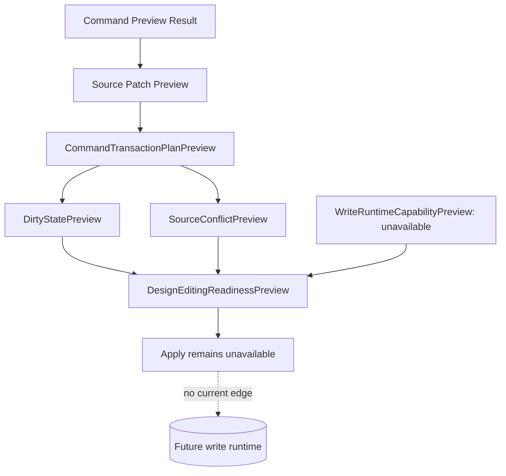

# Future Write Flow

[Docs index](../../README.md)

## At a glance

| Question | Answer |
| --- | --- |
| Is this implemented? | No write runtime is implemented. |
| Can any current flow write source files? | No. |
| Runtime owner | Future main/core write services. |
| Phase 6D status | Design editing preflight/readiness contracts only. |
| Safety risk controlled | Prevents dry-run preview, transaction planning, and editing readiness from being mistaken for mutation. |

> **Future-only:** Everything after the blocked write boundary is planning language, not available behavior.

## Purpose

Future write flow documents the path Crystal should eventually take to modify source files. Phase 6D adds preflight models that make the missing write boundary explicit before Design Editing MVP work: dirty-state preview, source-conflict preview, write-runtime capability preview, and design-editing readiness preview.

## Current implementation

There is no implemented write flow. No file is modified. No DOM node is inserted. No patch is applied. No write IPC exists. No undo/redo transaction is executed. Current Element Library, Source Patch Preview, Command Preview Bus, Phase 6C transaction planning, and Phase 6D design editing preflight flows stop at dry-run preview and planning.

Phase 6D boundary: No source files are written. No patch apply is available. No write IPC exists. Apply remains unavailable. No undo/redo execution runs. Dirty-state is not persisted. No refresh execution runs. No Preview DOM mutation occurs.

| Implemented | Blocked | Future |
| --- | --- | --- |
| Dry-run command preview. | File write. | Explicit write runtime. |
| Source Patch Preview. | Patch apply. | Atomic patch application. |
| History transaction preview model. | Real undo/redo. | Durable history log. |
| Refresh boundary planning model. | Refresh execution after writes. | Dirty-state/save workflow. |
| Design editing readiness preview. | Apply enablement. | Gated Apply/Save flow. |

## Key files and responsibilities

| File or path | Responsibility today | Reads | Must not do |
| --- | --- | --- | --- |
| `packages/core/commands/command-preview-bus/**` | Dry-run routing. | Command preview input. | Execute command. |
| `packages/core/source-patch/**` | Preview anchor and source patch payload. | Snapshot source location. | Persist files. |
| `packages/core/history/**` | Transaction preview descriptor. | Source Patch Preview metadata. | Execute undo/redo. |
| `packages/core/refresh-boundary/**` | Future invalidation descriptor. | Affected file list. | Reload Preview or mutate state. |
| `packages/core/commands/transaction-planning/**` | Joins command preview, source patch, history, and refresh descriptors. | Preview-only models. | Apply patches. |
| `packages/core/dirty-state/**` | Models unsaved-change state before persistence. | Transaction and patch preview IDs. | Persist dirty state. |
| `packages/core/source-conflict/**` | Models source freshness preconditions. | Version metadata only. | Read or hash files. |
| `packages/core/write-runtime/**` | States that write capability is absent. | Missing capability list. | Create a write runtime. |
| `packages/core/design-editing/**` | Summarizes readiness and blocked Apply state. | Preview-only contracts. | Enable Apply. |

Future write execution files do not exist yet.

## Data flow

| Step | Current or future | Input | Output |
| --- | --- | --- | --- |
| 1 | Current | Command Preview Result | Dry-run status. |
| 2 | Current | Source Patch Preview | Affected file and reversibility metadata. |
| 3 | Phase 6C | Source Patch Preview metadata | `HistoryTransactionPreview`. |
| 4 | Phase 6C | Affected files | `RefreshBoundaryPlan`. |
| 5 | Phase 6C | Command + patch + history + refresh descriptors | `CommandTransactionPlanPreview`. |
| 6 | Phase 6D | Transaction plan plus preflight inputs | `DesignEditingReadinessPreview` with `applyAvailable: false`. |
| 7 | Future | Validated transaction | Write, refresh, dirty-state, and real history execution. |

## Boundaries

Phase 6D models are preflight-only. They must not write files, apply patches, add IPC write channels, enable Apply, mutate iframe DOM, reload Preview, clear actual selection state, persist dirty state, or claim actual insertion.

> **Safety boundary:** A readiness preview is not permission to apply. It is a structured explanation of why Apply remains blocked.

## What this does not do

| Not provided | Reason |
| --- | --- |
| Real file write | Future-only write runtime is absent. |
| Patch apply | Source Patch Preview remains descriptive. |
| Write IPC | No IPC channel may cross the write boundary. |
| DOM mutation | Preview and user DOM remain read-only. |
| Real undo/redo | History descriptors are not executable. |
| Dirty-state persistence | Dirty state is future planning only. |
| Refresh execution | RefreshBoundaryPlan is descriptive only. |

## Validation

Current validation must keep failing if write behavior appears in preview-only, planning-only, or preflight-only modules. `validate:design-editing-preflight` checks Phase 6D modules, package script wiring, docs boundary language, blocked capability flags, forbidden filesystem writes, forbidden write IPC patterns, forbidden patch application symbols, forbidden renderer Apply wiring, and forbidden iframe internals.

## Related docs

- [Future command execution](../commands/future-command-execution.md)
- [Command Preview Bus](../commands/command-preview-bus.md)
- [Source Patch Preview](../commands/source-patch-preview.md)
- [Validation system](../validation-system.md)
- [ADR 0003](../../decisions/0003-command-preview-before-write.md)
- [Roadmap implementation](../../roadmap-implementation.md)

## Future work

Later phases can introduce controlled write execution only when persistence, history, dirty state, refresh execution, conflict detection, and validation are designed together.
