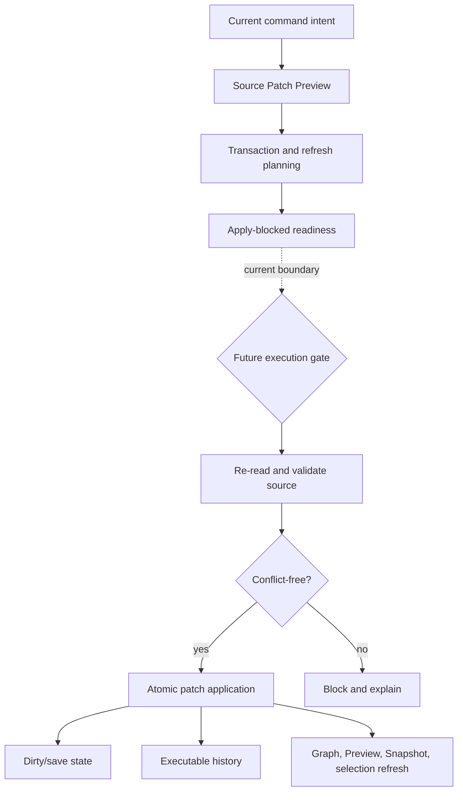

# Future write flow

[Docs index](../../README.md)

## Purpose

This page defines the lifecycle a future write must own. Everything after the current dry-run boundary is a requirement, not available behavior.

## Current implementation

No file is modified. No DOM node is inserted. No patch is applied. No write IPC exists. Current command previews, transaction plans, refresh plans, editing readiness, Inspector drafts, disabled Inspector controls, style inventory, CSS/Sass presentation, and authored candidates stop before execution.

## Key files

- `packages/core/commands/command-preview-bus`
- `packages/core/source-patch`
- `packages/core/history`
- `packages/core/refresh-boundary`
- `packages/core/design-editing`
- `packages/core/inspector-editing`
- `packages/core/style-engine`

## Data flow

Current data may describe command intent, source anchors, affected files, reversibility questions, invalidation targets, and Apply-blocked readiness. A future writer must revalidate every authority-bearing input at execution time, perform safe persistence, record executable history, update dirty state, and refresh every derived model.

## Boundaries

Current preview, planning, readiness, Inspector, and style modules must not write files. Renderer must not own persistence. Future execution must not treat stale Snapshot paths, visual rectangles, or authored style candidates as sufficient authority.

## Validation

Today’s validators must fail if write behavior appears in read-only modules. A future runtime needs dedicated tests for freshness, conflict detection, atomicity, rollback, history replay, dirty state, refresh ordering, and failure recovery.

## Related docs

- [Future command execution](../commands/future-command-execution.md)
- [Source Patch Preview](../commands/source-patch-preview.md)
- [Validation system](../validation-system.md)
- [ADR 0003](../../decisions/0003-command-preview-before-write.md)

## Future work

Implement the whole lifecycle as one explicit main/core capability. Partial persistence without history, refresh, and conflict behavior would create a fragile editor and should remain blocked.

## Read next

You are here: Future Write Flow.

Before this:
- [Source Patch Preview](../commands/source-patch-preview.md) is the current display-only endpoint.
- [Future command execution](../commands/future-command-execution.md) inventories the planning and readiness models already present.

Next:
- [Validation System](../validation-system.md) explains how negative guarantees are enforced until the writer exists.

Why this matters:
This is the hard boundary between useful preparation and real mutation. Keeping the entire lifecycle visible prevents an Apply button, planner, or IPC shortcut from implementing only the easy half of editing.
