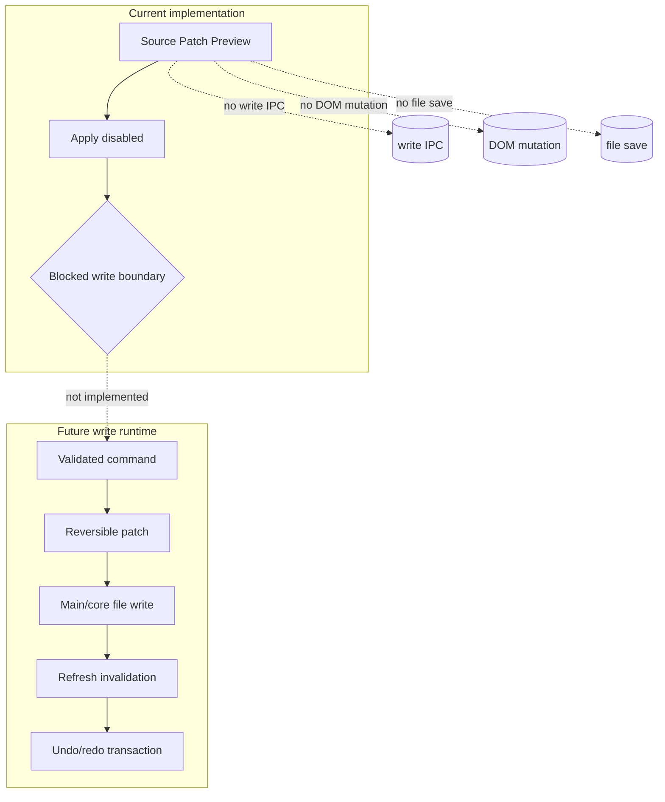

# Future Write Flow

[Docs index](../../README.md)

## At a glance

| Question | Answer |
| --- | --- |
| Is this implemented? | No. |
| Can any current flow write source files? | No. |
| Runtime owner | Future main/core write services. |
| Safety risk controlled | Prevents dry-run preview from being mistaken for mutation. |
| Related next phase | Phase 6C transaction skeletons and refresh-boundary planning. |

> **Future-only:** Everything after the blocked write boundary is planning language, not available behavior.

## Purpose

Future write flow documents the path Crystal should eventually take to modify source files. It is written now because the current UI already produces command intent and patch previews, and those previews must not be mistaken for writes.

## Why this exists

A clear future flow keeps current docs honest and gives later implementation work a checklist of missing safety contracts.

## How to read this page

Read the first table as the current truth, then the future flow as requirements for later work.

## Current implementation

There is no implemented write flow. No file is modified. No DOM node is inserted. No patch is applied. No write IPC exists. No undo/redo transaction is recorded. Current Element Library and Source Patch Preview flows stop at dry-run preview.

| Implemented | Blocked | Future |
| --- | --- | --- |
| Dry-run command preview. | File write. | Transaction creation. |
| Source Patch Preview. | Patch apply. | Atomic patch application. |
| Disabled Apply affordance. | Write IPC. | Dirty-state/save workflow. |
| Validation of blocked state. | DOM mutation. | Undo/redo transactions. |

## Flow summary

| Step | Actor | Input | Decision | Output |
| --- | --- | --- | --- | --- |
| 1 | Current UI/core | Preview-ready result | Is execution runtime available? | No; blocked. |
| 2 | Future core | Valid command | Is source fresh? | Reversible patch or conflict. |
| 3 | Future main/core | Reversible patch | Can it apply atomically? | File update or failure. |
| 4 | Future state manager | Applied change | What derived state is invalid? | Refresh plan. |
| 5 | Future history | Transaction record | Can change be reversed? | Undo/redo descriptor. |

## Key files

These are current dry-run files only. Do not use them as evidence of write support.

## Key files and responsibilities

| File or path | Responsibility today | Reads | Must not do |
| --- | --- | --- | --- |
| `packages/core/commands/command-preview-bus/**` | Dry-run routing. | Command preview input. | Execute command. |
| `packages/core/commands/html-insertion/**` | Preview planning. | Command + anchor. | Apply patch. |
| `packages/core/source-patch/**` | Preview anchor/payload. | Snapshot source location. | Persist files. |
| `html-element-library-panel/**` | Display intent and preview. | Preview result. | Enable active Apply. |

Future write execution files do not exist yet.

## Data flow

A future write flow would start from a validated command, generate a reversible patch, create a transaction record, apply through main/core services, update dirty state, refresh Project Graph, invalidate DOM Snapshot, reload Preview where required, and register undo/redo descriptors. None of that is available now.

## Main diagram

## Failure and blocked states

| State | Why it happens | What Crystal does |
| --- | --- | --- |
| Apply unavailable | Execution runtime does not exist. | Keeps action disabled/future-only. |
| Preview-ready only | Dry-run result is display state. | Does not persist. |
| No transaction model | Undo/redo cannot be guaranteed. | Blocks writes. |
| No refresh boundary | Derived state could go stale. | Blocks writes. |

## Boundaries

Phase 6C may define transaction skeletons and refresh-boundary planning contracts only. It must not write files, apply patches, add IPC write channels, enable Apply, mutate iframe DOM, or claim actual insertion.

## What this does not do

| Not provided | Reason |
| --- | --- |
| Real file write | Future-only. |
| Patch apply | Future-only. |
| Write IPC | Future-only. |
| DOM mutation | Future-only. |
| Real undo/redo | Future-only. |

## Common misunderstanding

> **Common misunderstanding:** Phase 6C is the next logical planning step, not the point where writes become available.

## Validation

Current validation must keep failing if write behavior appears in preview-only modules. Future validation should test write gating, conflict detection, transaction reversibility, and refresh invalidation.

## Related docs

- [Future command execution](../commands/future-command-execution.md)
- [Command Preview Bus](../commands/command-preview-bus.md)
- [Source Patch Preview](../commands/source-patch-preview.md)
- [ADR 0003](../../decisions/0003-command-preview-before-write.md)
- [Roadmap implementation](../../roadmap-implementation.md)

## Future work

After Phase 6C, later phases can introduce controlled write execution only when persistence, history, and validation are designed together.
