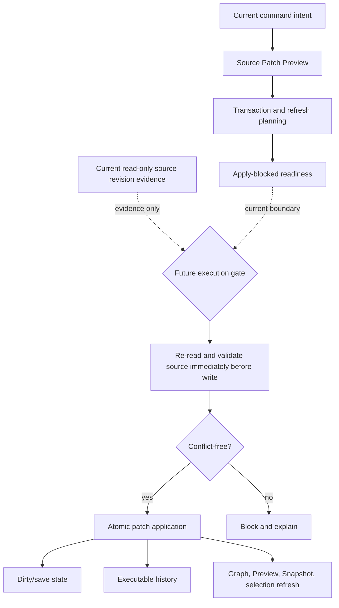

# Future write flow

[Docs index](../../README.md)

## Purpose

This page defines the lifecycle a future write must own. Everything after the current read-only and dry-run boundaries is a requirement, not available write behavior.

## Current implementation

No file is modified. No DOM node is inserted. No patch is applied. No write IPC exists. Current command previews, transaction plans, refresh plans, editing readiness, Inspector drafts, disabled Inspector controls, style inventory, CSS/Sass presentation, and authored candidates stop before execution.

Crystal now has an implemented, read-only Source Revision and Freshness Foundation. It can read a real project-relative file through a root-contained Node adapter, calculate a canonical `sha256:<byteLength>:<64-lowercase-hex>` revision from exact bytes, compare it with an expected canonical revision, and produce match, mismatch, unavailable, or blocked evidence. It does not connect that evidence to command execution and does not complete the conflict gate of a writer that does not yet exist.

## Key files

- `packages/core/commands/command-preview-bus`
- `packages/core/source-patch`
- `packages/core/source-conflict`
- `packages/adapters/file-system/source-revision.adapter.ts`
- `packages/core/history`
- `packages/core/refresh-boundary`
- `packages/core/design-editing`
- `packages/core/inspector-editing`
- `packages/core/style-engine`

## Data flow

Current data may describe command intent, source anchors, affected files, reversibility questions, invalidation targets, Apply-blocked readiness, and a canonical revision observed from real bytes. `SourceConflictPreview` may now consume that revision evidence, but `canApplyWithoutRecheck` remains `false` even for `clean-preview`.

A future writer must read the target again immediately before mutation, compare the observed revision with the expected revision, reject conflict or blocked evidence, perform safe persistence, record executable history, update dirty state, and refresh every derived model. A revision produced earlier in a preview flow is evidence, not durable write authority.

## Boundaries

Phase 6C models are planning-only; current preview, planning, readiness, Inspector, style, source-conflict, and revision-observation modules must not write files. Renderer must not own persistence. Future execution must not treat stale Snapshot paths, visual rectangles, authored style candidates, mtime, size alone, or a previously clean preview as sufficient authority.

The revision token contains no absolute path or mtime, and the adapter does not normalize content, line endings, or Unicode. Path validation and canonical containment block absolute paths, `.` or `..` segments, lexical root escape, and symlink escape.

## Canonical phase boundary statements

The repository validators preserve the following historical phase contracts verbatim. They describe the scope of each increment when it landed; they do not erase later read-only additions.

- Phase 6D remained preflight-only.
- Phase 7A was the Editable Inspector draft/intent foundation.
- Phase 7B added the Editable Inspector read-only draft surface.
- Phase 8A introduced the Style Engine read-only source inventory foundation. No CSS/Sass Inspector visual surface is added within that phase.

Across those boundaries: No real cascade is calculated. No computed styles are read. No style editing is implemented. No source files are written. No patch apply is available. No write IPC exists. Apply remains unavailable. No contenteditable is used. No undo/redo execution runs. Dirty-state is not persisted. No refresh execution runs. No Preview DOM mutation occurs.

## Validation

`npm run validate:source-freshness-foundation` compiles and executes the core and adapter behavior against temporary files outside the repository. It verifies deterministic byte revisions, same-size and same-mtime conflicts, Unicode byte length, line-ending distinction, path rejection, canonical containment, symlink escape, typed failures, preview mapping, and the permanent recheck requirement. Current validators still fail if write behavior appears in read-only modules.

## Related docs

- [Future command execution](../commands/future-command-execution.md)
- [Source Patch Preview](../commands/source-patch-preview.md)
- [Validation system](../validation-system.md)
- [ADR 0003](../../decisions/0003-command-preview-before-write.md)

## Future work

Connect a new execution-time gate only when a main/core writer exists. That writer must repeat the revision read immediately before writing and then own exact patching, atomic persistence, history, dirty state, refresh ordering, and failure recovery. The current foundation does not authorize Apply and leaves `conflict-detector` in the write-runtime missing-capability list.

## Read next

You are here: Future Write Flow.

Before this:
- [Source Patch Preview](../commands/source-patch-preview.md) is the current display-only endpoint.
- [Future command execution](../commands/future-command-execution.md) inventories the planning, readiness, and freshness models already present.

Next:
- [Validation System](../validation-system.md) explains how negative guarantees are enforced until the writer exists.

Why this matters:
This is the hard boundary between useful preparation and real mutation. Keeping the entire lifecycle visible prevents an Apply button, planner, freshness preview, or IPC shortcut from implementing only the easy half of editing.
