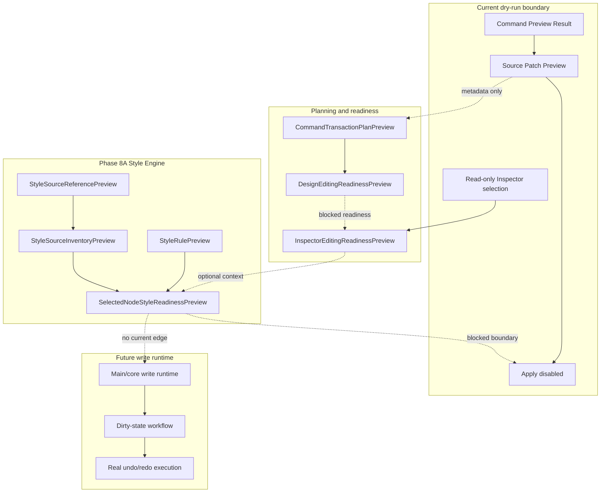

# Future Write Flow

[Docs index](../../README.md)

> **Navigation:** [Start here](../../README.md) → [Guided reading](../../guided-reading.md) → [Commands Architecture](../commands/README.md) → [Source Patch Preview](../commands/source-patch-preview.md) → Future Write Flow → [Validation System](../validation-system.md)

## At a glance

| Question | Answer |
| --- | --- |
| Is this implemented? | No write runtime is implemented. |
| Can any current flow write source files? | No. |
| Runtime owner | Future main/core write services. |
| Phase 6C status | Planning contracts only. |
| Phase 6D status | Design editing preflight/readiness contracts only. |
| Phase 7A status | Editable Inspector draft/intent foundation only. |
| Phase 7B status | Editable Inspector read-only draft surface only. |
| Phase 8A status | Style Engine read-only source inventory foundation only. |
| Safety risk controlled | Prevents dry-run preview, transaction planning, editing readiness, Inspector edit intent, disabled Inspector controls, and style source inventory from being mistaken for mutation. |

> **Future-only:** Everything after the blocked write boundary is planning language, not available behavior.

## Purpose

Future write flow documents the path Crystal should eventually take to modify source files. Phase 8A adds style source inventory and selected-node style readiness contracts for a future CSS/Sass Inspector, but it does not cross into persistence, patch application, write IPC, Apply enablement, computed style reads, real cascade, or Preview DOM mutation.

## Current implementation

There is no implemented write flow. No file is modified. No DOM node is inserted. No patch is applied. No write IPC exists. No undo/redo transaction is executed. Current Element Library, Source Patch Preview, Command Preview Bus, Phase 6C transaction planning, Phase 6D design editing preflight, Phase 7A Editable Inspector draft/intent foundation, Phase 7B Editable Inspector read-only draft surface, and Phase 8A Style Engine source inventory flows stop at dry-run preview, planning, readiness, intent descriptors, disabled controls, or inventory descriptors.

Phase 8A boundary: Style Engine read-only source inventory foundation only. No CSS/Sass Inspector visual surface is added. No real cascade is calculated. No computed styles are read. No style editing is implemented. No source files are written. No patch apply is available. No write IPC exists. Apply remains unavailable. No contenteditable is used. No undo/redo execution runs. Dirty-state is not persisted. No refresh execution runs. No Preview DOM mutation occurs.

| Implemented | Blocked | Future |
| --- | --- | --- |
| Dry-run command preview. | File write. | Explicit write runtime. |
| Source Patch Preview. | Patch apply. | Atomic patch application. |
| History transaction preview model. | Real undo/redo. | Durable history log. |
| Refresh boundary planning model. | Refresh execution after writes. | Dirty-state/save workflow. |
| Design editing readiness preview. | Apply enablement. | Gated Apply/Save flow. |
| Inspector edit draft/intent previews. | Applied Inspector edits. | Gated Inspector Apply flow. |
| Disabled Editable Inspector surface. | Editable field mutation. | Gated Inspector Apply flow. |
| Style source inventory preview. | Style writes. | CSS/Sass Inspector. |
| Selected-node style readiness. | Computed styles and cascade. | Cascade Map and authored/computed correlation. |

## Key files

These are current dry-run, planning, readiness, draft/intent, read-only surface, and inventory files only. They must not be used as evidence of write support.

## Key files and responsibilities

| File or path | Responsibility today | Reads | Must not do |
| --- | --- | --- | --- |
| `packages/core/commands/command-preview-bus/**` | Dry-run routing. | Command preview input. | Execute command. |
| `packages/core/source-patch/**` | Preview anchor and source patch payload. | Snapshot source location. | Persist files. |
| `packages/core/history/**` | Transaction preview descriptor. | Source Patch Preview metadata. | Execute undo/redo. |
| `packages/core/refresh-boundary/**` | Future invalidation descriptor. | Affected file list. | Reload Preview or mutate state. |
| `packages/core/design-editing/**` | Summarizes readiness and blocked Apply state. | Preview-only contracts. | Enable Apply. |
| `packages/core/inspector-editing/**` | Models future Inspector fields, drafts, intents, readiness, and read-only surface view model. | Selection path and source-location availability. | Mutate DOM or write source. |
| `packages/core/style-engine/**` | Models read-only style sources, inventory, selectors, declarations, rules, and selected-node style readiness. | Caller-supplied text and source references. | Read computed styles, calculate real cascade, edit styles, apply patches, or write files. |
| `html-element-library-panel/**` | Displays intent and preview. | Preview result. | Enable active Apply. |

Future write execution files do not exist yet.

## Data flow

| Step | Current or future | Input | Output |
| --- | --- | --- | --- |
| 1 | Current | Command Preview Result | Dry-run status. |
| 2 | Current | Source Patch Preview | Affected file and reversibility metadata. |
| 3 | Phase 6C | Source Patch Preview metadata | `HistoryTransactionPreview`. |
| 4 | Phase 6C | Affected files | `RefreshBoundaryPlan`. |
| 5 | Phase 6D | Transaction plan plus preflight inputs | `DesignEditingReadinessPreview` with `applyAvailable: false`. |
| 6 | Phase 7A | Preview Inspector selection, draft field values, and edit intents | `InspectorEditingReadinessPreview` with `applyAvailable: false`. |
| 7 | Phase 7B | InspectorEditingReadinessPreview and draft fields | Disabled/read-only Inspector surface. |
| 8 | Phase 8A | Caller-supplied HTML/style text and source references | `StyleSourceInventoryPreview` and selected-node style readiness with `canApply: false`. |
| 9 | Future | Validated transaction | Write, refresh, dirty-state, and real history execution. |

## Boundaries

- Phase 6C models are planning-only; they describe HistoryTransactionPreview, RefreshBoundaryPlan, and CommandTransactionPlanPreview without executing writes, refreshes, undo, or redo.

Phase 8A models are inventory-only. They must not write files, apply patches, add IPC write channels, enable Apply, use contenteditable, mutate iframe DOM, reload Preview, clear actual selection state, persist dirty state, claim applied style editing, read computed styles, calculate real cascade, or expose a CSS/Sass Inspector visual surface. Any later write flow must not write files until persistence, conflict detection, history execution, refresh execution, and Apply UX are designed together.

> **Safety boundary:** A transaction preview is not a transaction record, a refresh-boundary plan is not a refresh operation, a design editing readiness preview is not permission to apply, an Inspector edit intent is not a write command, and a Style Engine inventory is not style editing.

## What this does not do

| Not provided | Reason |
| --- | --- |
| Real file write | Future-only write runtime is absent. |
| Patch apply | Source Patch Preview remains descriptive. |
| Write IPC | No IPC channel may cross the write boundary. |
| DOM mutation | Preview and user DOM remain read-only. |
| Real undo/redo | History descriptors are not executable. |
| Dirty-state persistence | No dirty-state store exists. |
| Refresh execution | RefreshBoundaryPlan is descriptive only. |
| Apply enablement | Write runtime capability is unavailable. |
| CSS/Sass Inspector visual surface | Phase 8A is core-only. |
| Real cascade | Phase 8A does not calculate cascade. |
| Computed styles | Phase 8A does not read computed styles. |
| Style editing | Style declarations remain preview-only. |

## Common misunderstanding

> **Common misunderstanding:** Adding style inventory does not mean Crystal can edit CSS. Adding selector and declaration previews does not mean Crystal knows the applied cascade. Adding selected-node style readiness does not mean Apply can run. There is still no write and therefore no executed transaction to undo.

## Validation

Current validation must keep failing if write behavior appears in preview-only, planning-only, preflight-only, draft/intent-only, disabled-surface, or inventory-only modules. `validate:style-engine-foundation` adds Phase 8A checks for read-only style source models, `canWriteSource: false`, `canApply: false`, `canInspectComputedStyles: false`, no browser stylesheet object usage, no iframe internals, no write IPC, no patch apply, no refresh execution, and no Preview DOM mutation. `validate:guided-docs` keeps this page in the editing and Style Engine reading paths.

## Related docs

- [Guided reading](../../guided-reading.md)
- [Future command execution](../commands/future-command-execution.md)
- [Command Preview Bus](../commands/command-preview-bus.md)
- [Source Patch Preview](../commands/source-patch-preview.md)
- [Validation system](../validation-system.md)
- [ADR 0003](../../decisions/0003-command-preview-before-write.md)
- [Roadmap implementation](../../roadmap-implementation.md)

## Future work

Later phases can introduce controlled CSS/Sass Inspector UI and write execution only when persistence, history, dirty state, refresh execution, conflict detection, Inspector Apply UX, style source ownership, authored/computed style correlation, and validation are designed together.

## Read next

You are here: Future Write Flow.

Before this:
- [Source Patch Preview](../commands/source-patch-preview.md) explains the current patch-like output that still does not apply anything.
- [Future command execution](../commands/future-command-execution.md) maps future execution concepts without enabling them.

Next:
- [Validation System](../validation-system.md) shows how these blocked states are enforced by scripts.

Related:
- [Guided reading](../../guided-reading.md)
- [Roadmap implementation status](../../roadmap-implementation.md)
- [ADR 0003](../../decisions/0003-command-preview-before-write.md)
- Validator: [`validate:history-foundation`](../../../scripts/validate-history-foundation.mjs)
- Validator: [`validate:style-engine-foundation`](../../../scripts/validate-style-engine-foundation.mjs)

Why this matters:
This page is the hard boundary between preview/planning/readiness/inventory models and real mutation. It keeps Phase 6C, 6D, 7A, 7B, and 8A language from being mistaken for source write support.
