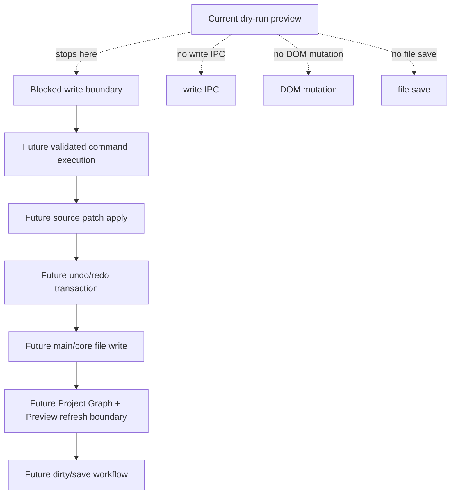

# Future Write Flow

[Docs index](../../README.md)

## Purpose

Future write flow documents the path Crystal should eventually take to modify source files. It is written now because the current UI already produces command intent and patch previews, and those previews must not be mistaken for writes.

## Current implementation

There is no implemented write flow. No file is modified. No DOM node is inserted. No patch is applied. No write IPC exists. No undo/redo transaction is recorded. Current Element Library and Source Patch Preview flows stop at dry-run preview.

The diagram marks the boundary explicitly. Everything after `Blocked write boundary` is future planning, not current behavior.

## Key files

These are current dry-run files only. Do not use them as evidence of write support.

- `packages/core/commands/command-preview-bus/**`
- `packages/core/commands/html-insertion/**`
- `packages/core/source-patch/**`
- `apps/desktop/electron/renderer/components/html-element-library-panel/**`
- `scripts/validate-source-patch-preview.mjs`

Future write execution files do not exist yet.

## Data flow

A future write flow would start from a validated command, generate a reversible patch, create a transaction record, apply through main/core services, update dirty state, refresh Project Graph, invalidate DOM Snapshot, reload Preview where required, and register undo/redo descriptors. None of that is available now.

## Boundaries

Phase 6C may define transaction skeletons and refresh-boundary planning contracts only. It must not write files, apply patches, add IPC write channels, enable Apply, mutate iframe DOM, or claim actual insertion.

## Validation

Current validation must keep failing if write behavior appears in preview-only modules. Future validation should test write gating, conflict detection, transaction reversibility, and refresh invalidation.

## Related docs

- [Future command execution](../commands/future-command-execution.md)
- [Command Preview Bus](../commands/command-preview-bus.md)
- [Source Patch Preview](../commands/source-patch-preview.md)
- [ADR 0003](../../decisions/0003-command-preview-before-write.md)
- [Roadmap implementation](../../roadmap-implementation.md)

## Future work

After Phase 6C, later phases can introduce controlled write execution only when persistence, history, and validation are designed together.
