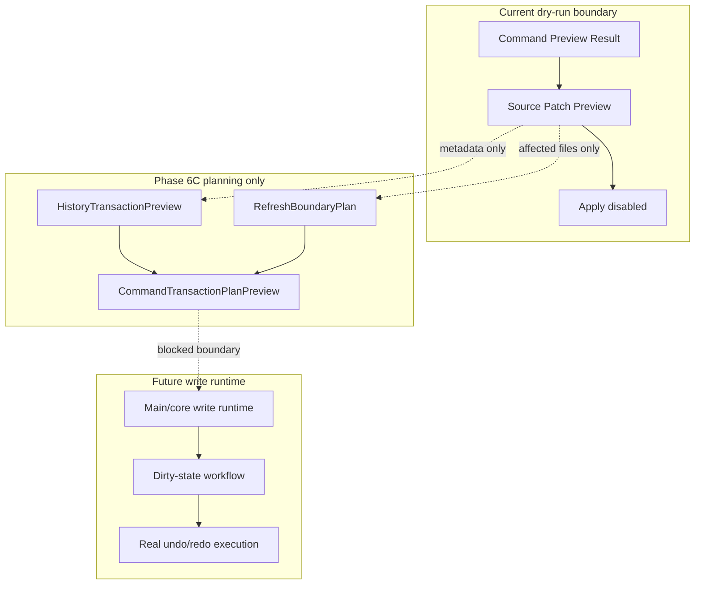

# Future Write Flow

[Docs index](../../README.md)

## At a glance

| Question | Answer |
| --- | --- |
| Is this implemented? | No write runtime is implemented. |
| Can any current flow write source files? | No. |
| Runtime owner | Future main/core write services. |
| Phase 6C status | Planning contracts only. |
| Safety risk controlled | Prevents dry-run preview and transaction planning from being mistaken for mutation. |

> **Future-only:** Everything after the blocked write boundary is planning language, not available behavior.

## Purpose

Future write flow documents the path Crystal should eventually take to modify source files. Phase 6C adds planning models that make the missing write boundary explicit: a command preview may be associated with a transaction preview and a refresh-boundary plan, but that association is still descriptive only.

## Why this exists

A future editor needs a reversible write path. The current application has Source Patch Preview and dry-run command previews, so the codebase now needs planning contracts that describe history and refresh consequences without crossing into persistence.

## How to read this page

| Need | Read |
| --- | --- |
| Current truth | Current implementation and boundaries. |
| Phase 6C addition | Planning-only models. |
| Future writing | Future write runtime and future work. |

## Current implementation

There is no implemented write flow. No file is modified. No DOM node is inserted. No patch is applied. No write IPC exists. No undo/redo transaction is executed. Current Element Library, Source Patch Preview, Command Preview Bus, and Phase 6C transaction planning flows stop at dry-run preview and planning.

| Implemented | Blocked | Future |
| --- | --- | --- |
| Dry-run command preview. | File write. | Explicit write runtime. |
| Source Patch Preview. | Patch apply. | Atomic patch application. |
| History transaction preview model. | Real undo/redo. | Durable history log. |
| Refresh boundary planning model. | Refresh execution after writes. | Dirty-state/save workflow. |
| Disabled Apply affordance. | Write IPC. | Gated Apply/Save flow. |

## Key files

These are current dry-run and planning files only. Do not use them as evidence of write support.

## Key files and responsibilities

| File or path | Responsibility today | Reads | Must not do |
| --- | --- | --- | --- |
| `packages/core/commands/command-preview-bus/**` | Dry-run routing. | Command preview input. | Execute command. |
| `packages/core/source-patch/**` | Preview anchor and source patch payload. | Snapshot source location. | Persist files. |
| `packages/core/history/**` | Transaction preview descriptor. | Source Patch Preview metadata. | Execute undo/redo. |
| `packages/core/refresh-boundary/**` | Future invalidation descriptor. | Affected file list. | Reload Preview or mutate state. |
| `packages/core/commands/transaction-planning/**` | Joins command preview, source patch, history, and refresh descriptors. | Preview-only models. | Apply patches. |
| `html-element-library-panel/**` | Displays intent and preview. | Preview result. | Enable active Apply. |

Future write execution files do not exist yet.

## Data flow

| Step | Current or future | Input | Output |
| --- | --- | --- | --- |
| 1 | Current | Command Preview Result | Dry-run status. |
| 2 | Current | Source Patch Preview | Affected file and reversibility metadata. |
| 3 | Phase 6C | Source Patch Preview metadata | `HistoryTransactionPreview`. |
| 4 | Phase 6C | Affected files | `RefreshBoundaryPlan`. |
| 5 | Phase 6C | Command + patch + history + refresh descriptors | `CommandTransactionPlanPreview`. |
| 6 | Future | Validated transaction | Write, refresh, dirty-state, and real history execution. |

## Boundaries

Phase 6C models are planning-only. They must not write files, apply patches, add IPC write channels, enable Apply, mutate iframe DOM, reload Preview, clear actual selection state, persist dirty state, or claim actual insertion.

> **Safety boundary:** A transaction preview is not a transaction record, and a refresh-boundary plan is not a refresh operation.

## What this does not do

| Not provided | Reason |
| --- | --- |
| Real file write | Future-only write runtime is absent. |
| Patch apply | Source Patch Preview remains descriptive. |
| Write IPC | No IPC channel may cross the write boundary. |
| DOM mutation | Preview and user DOM remain read-only. |
| Real undo/redo | History descriptors are not executable. |
| Dirty-state mutation | Dirty state is future planning only. |

## Common misunderstanding

> **Common misunderstanding:** Adding a transaction preview does not mean Crystal can undo a write. There is still no write and therefore no executed transaction to undo.

## Validation

Current validation must keep failing if write behavior appears in preview-only or planning-only modules. `validate:history-foundation` checks the Phase 6C modules, package script wiring, safe statuses, forbidden filesystem writes, forbidden write IPC patterns, forbidden patch application symbols, and forbidden iframe internals.

## Related docs

- [Future command execution](../commands/future-command-execution.md)
- [Command Preview Bus](../commands/command-preview-bus.md)
- [Source Patch Preview](../commands/source-patch-preview.md)
- [Validation system](../validation-system.md)
- [ADR 0003](../../decisions/0003-command-preview-before-write.md)
- [Roadmap implementation](../../roadmap-implementation.md)

## Future work

Later phases can introduce controlled write execution only when persistence, history, dirty state, refresh execution, conflict detection, and validation are designed together.
