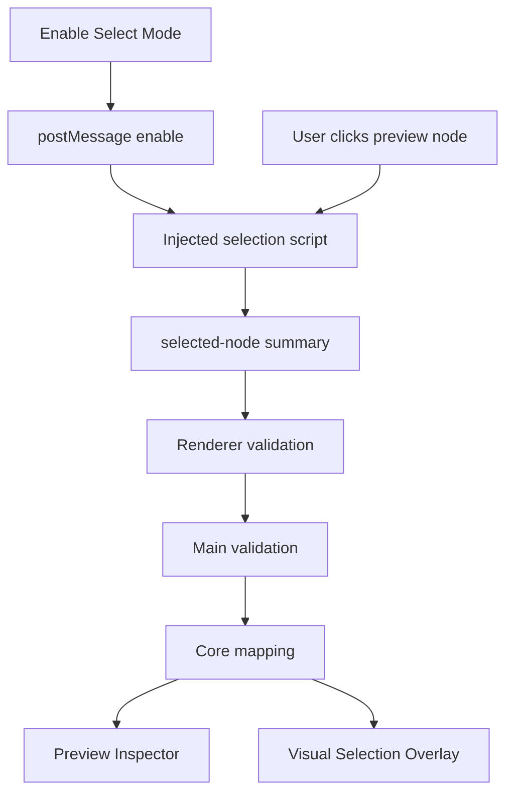

# Preview Selection Flow

[Docs index](../../README.md)

## Purpose

Preview Selection flow explains how a click in the rendered iframe becomes safe application state. The important part is not the click itself; it is the validation and mapping that follow before any other panel treats the target as meaningful.

## Current implementation

Selection mode starts disabled. Renderer enables it by messaging the iframe. The injected script emits a bounded selected-node summary. Renderer checks the message source and shape, main validates again, and core maps the summary against DOM Snapshot state.

The diagram reads from visual event to derived consumers. Inspector and Overlay are downstream of mapping; they do not own selection truth.

## Key files

These files divide message transport, validation, mapping, and rendering.

- `apps/desktop/electron/renderer/components/project-preview-panel/selection/project-preview-selection-message-bridge.ts`
- `apps/desktop/electron/main/preview-selection/project-preview-selection-service.ts`
- `packages/core/project/preview-selection/project-preview-selection-validators.ts`
- `packages/core/project/preview-selection/mapping/project-preview-selection-mapping.ts`
- `packages/core/project/preview-inspector/project-preview-inspector-selector.ts`

## Data flow

The selected-node summary carries limited identity hints. The mapping step decides whether the static DOM Snapshot confirms the visual target. The result can be matched or defensive. Downstream panels must respect that result.

## Boundaries

This flow does not edit DOM or source. It does not use live iframe document access. It does not promote ambiguous or mismatched selections to trusted state.

## Validation

`validate:preview-selection`, `validate:preview-inspector`, and `validate:visual-selection-overlay` cover this flow.

## Related docs

- [Preview Selection](../preview/preview-selection.md)
- [DOM Snapshot](../preview/dom-snapshot.md)
- [Preview Inspector](../preview/preview-inspector.md)
- [Preview selection sequence](../diagrams/preview-selection-sequence.md)

## Future work

Hover, breadcrumbs, scroll-to-node, and multi-select should be added as explicit read-only states before they become inputs to any write workflow.
