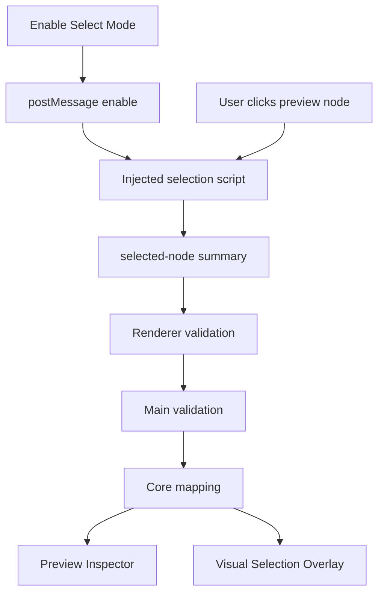

# Preview Selection Flow

[Docs index](../../README.md)

## Purpose

This document traces the implemented read-only selection path from user click to derived Inspector and Overlay state.

## Current implementation

Selection mode is off by default. Renderer enables it through a namespaced `postMessage`. The injected Preview script reports bounded node summaries. Renderer validates the message and sends it through preload. Main validates again, core maps to DOM Snapshot, and renderer updates read-only panels.

## Key files

- `apps/desktop/electron/renderer/components/project-preview-panel/selection/project-preview-selection-message-bridge.ts`
- `apps/desktop/electron/main/preview-selection/project-preview-selection-service.ts`
- `packages/core/project/preview-selection/project-preview-selection-validators.ts`
- `packages/core/project/preview-selection/mapping/project-preview-selection-mapping.ts`
- `packages/core/project/preview-inspector/project-preview-inspector-selector.ts`

## Data flow

The selected-node summary carries limited metadata: tag, attributes preview, text preview, depth, sibling index, snapshot path hints, selector preview, and mapping result. Trusted structural details come only from static DOM Snapshot when mapping is `matched`.

## Boundaries

This flow is not a DOM editor. It does not use live iframe document access. It does not write source. It does not make ambiguous or mismatched selections look trusted.

## Validation

`validate:preview-selection`, `validate:preview-inspector`, and `validate:visual-selection-overlay` cover this flow.

## Related docs

- [Preview Selection](../preview/preview-selection.md)
- [DOM Snapshot](../preview/dom-snapshot.md)
- [Preview Inspector](../preview/preview-inspector.md)
- [Preview selection sequence](../diagrams/preview-selection-sequence.md)

## Future work

Future hover, breadcrumbs, scroll-to-node, and multi-select must remain read-only until source write and history boundaries exist.
