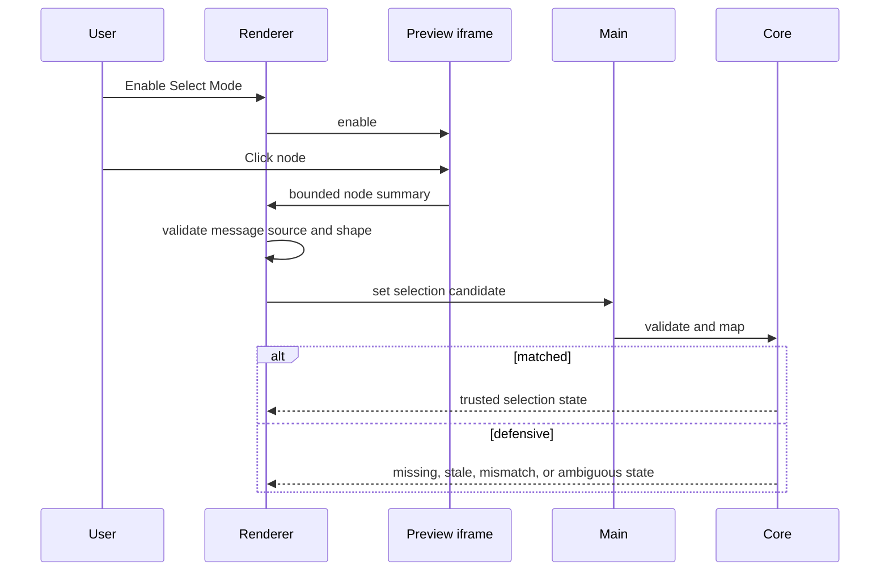

# Preview Selection flow

[Docs index](../../README.md)

## Purpose

This flow turns a click inside untrusted rendered content into read-only application state that may—or may not—map to the current source-derived snapshot.

## Current implementation

Select Mode begins disabled. Renderer activates the injected script through a namespaced message. The iframe emits a bounded node summary and optional rectangle. Renderer verifies the source window and payload, main validates again, and core correlates the candidate with current Preview and DOM Snapshot state.

## Key files

- `project-preview-selection-message-bridge.ts`
- `project-preview-selection-service.ts`
- `project-preview-selection-validators.ts`
- `project-preview-selection-mapping.ts`
- `project-preview-selection-mapping-lookup.ts`

## Data flow

The iframe provides limited visual identity hints. Current Preview load and Snapshot state provide context. Core refuses trust when inputs disagree, are stale, or yield multiple candidates. Inspector and overlay consume the mapping result rather than the raw click.

## Boundaries

No step edits DOM or source. Renderer does not read iframe internals. Defensive states remain first-class output and cannot be coerced to matched for UI convenience.

## Validation

Run `validate:preview-selection`, plus Inspector and overlay validators when downstream presentation changes.

## Related docs

- [Preview Selection](../preview/preview-selection.md)
- [Preview Inspector](../preview/preview-inspector.md)
- [Preview Selection sequence](../diagrams/preview-selection-sequence.md)

## Future work

Hover, breadcrumbs, scroll-to-node, and multi-select should add separate state and validation while preserving the same trust decision.
