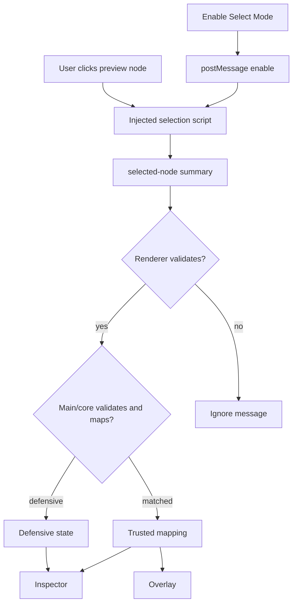

# Preview Selection Flow

[Docs index](../../README.md)

## At a glance

| Question | Answer |
| --- | --- |
| Is this implemented? | Yes, read-only. |
| Can it mutate DOM or source? | No. |
| Runtime owner | Iframe emits; renderer/main/core validate and map. |
| Safety risk controlled | Prevents visual clicks from becoming source authority. |
| Related next phase | Future hover/multi-select states. |

## Purpose

Preview Selection flow explains how a click in the rendered iframe becomes safe application state. The important part is the validation and mapping that follow.

## Why this exists

Crystal must connect visual interaction to source reasoning without reading iframe internals or trusting the browser DOM as source truth.

## How to read this page

Use the flow summary for the handoff and the failure table for defensive states.

## Current implementation

Selection mode starts disabled. Renderer enables it by messaging the iframe. The injected script emits a bounded selected-node summary. Renderer checks the message source and shape, main validates again, and core maps the summary against DOM Snapshot state.

| Implemented | Blocked | Future |
| --- | --- | --- |
| Bounded click payload. | DOM mutation. | Hover selection. |
| Snapshot mapping. | Source writes. | Multi-selection. |
| Defensive states. | Live iframe document reads. | Breadcrumbs. |

## Flow summary

| Step | Actor | Input | Decision | Output |
| --- | --- | --- | --- | --- |
| 1 | Renderer | Select Mode toggle | Should selection script activate? | Enable/disable message. |
| 2 | Iframe | User click | Is selection mode active? | Selected-node summary. |
| 3 | Renderer | Message event | Is source/payload valid? | Candidate selection. |
| 4 | Main/core | Candidate + snapshot | Can it map safely? | Matched or defensive state. |
| 5 | Renderer | Selection state | Which panels can derive UI? | Inspector/Overlay update. |

## Key files

These files divide message transport, validation, mapping, and rendering.

## Key files and responsibilities

| File | Responsibility | Reads | Must not do |
| --- | --- | --- | --- |
| `project-preview-selection-message-bridge.ts` | Iframe message bridge. | Message event. | Read iframe DOM. |
| `project-preview-selection-service.ts` | Main selection state. | Bounded payload. | Trust invalid payloads. |
| `project-preview-selection-validators.ts` | Payload validation. | Candidate data. | Infer source truth. |
| `project-preview-selection-mapping.ts` | Snapshot mapping. | Selection + snapshot. | Accept ambiguity as match. |

## Data flow

The selected-node summary carries limited identity hints. The mapping step decides whether the static DOM Snapshot confirms the visual target. The result can be matched or defensive.

## Main diagram

## Failure and blocked states

| State | Why it happens | What Crystal does |
| --- | --- | --- |
| Selection disabled | User has not enabled Select Mode. | Does not emit selection. |
| Invalid message | Payload/source check fails. | Ignores message. |
| Missing snapshot | No static model to map against. | Shows defensive state. |
| Ambiguous/mismatch | Visual and source data disagree. | Refuses trusted mapping. |

## Boundaries

This flow does not edit DOM or source. It does not use live iframe document access. It does not promote ambiguous or mismatched selections to trusted state.

## What this does not do

| Not provided | Reason |
| --- | --- |
| Editing | No command execution. |
| DOM mutation | Preview isolation. |
| Live iframe reads | Security boundary. |

## Common misunderstanding

> **Common misunderstanding:** The flow produces selection state, not edit permission.

## Validation

`validate:preview-selection`, `validate:preview-inspector`, and `validate:visual-selection-overlay` cover this flow.

## Related docs

- [Preview Selection](../preview/preview-selection.md)
- [DOM Snapshot](../preview/dom-snapshot.md)
- [Preview Inspector](../preview/preview-inspector.md)
- [Preview selection sequence](../diagrams/preview-selection-sequence.md)

## Future work

Hover, breadcrumbs, scroll-to-node, and multi-select should be added as explicit read-only states before they become inputs to any write workflow.
