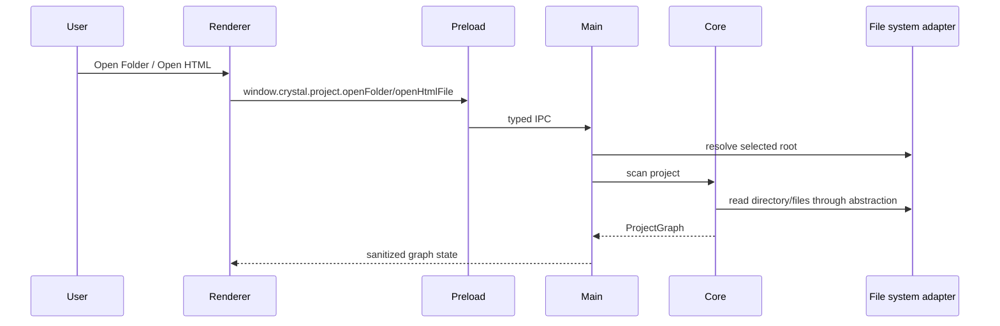

# Project Open Flow

[Docs index](../../README.md)

## Purpose

Project open is the first point where Crystal turns a user-selected filesystem location into application state. It matters because every later feature, including Preview and Source Patch Preview, depends on the active root and graph being resolved by main rather than guessed by renderer.

## Current implementation

The renderer requests Open Folder or Open HTML through preload. Electron main owns dialogs and root resolution. Core scans the selected root through filesystem abstractions and returns Project Graph state. Main stores and emits that sanitized state.

The sequence shows where authority moves: user intent starts in renderer, but filesystem decisions happen in main and core.

## Key files

Read these files from main orchestration down to core scanning.

- `apps/desktop/electron/main/ipc/register-project-ipc.ts`
- `apps/desktop/electron/main/ipc/project-scan-service.ts`
- `apps/desktop/electron/main/ipc/project-services.ts`
- `packages/core/project/scanning/project-scanner.ts`
- `packages/core/project/graph/project-graph-builder.ts`
- `packages/core/project/graph/project-graph.ts`
- `packages/adapters/file-system/file-system.adapter.ts`
- `apps/desktop/electron/renderer/components/project-graph-panel/project-graph-panel.ts`

## Data flow

The selected folder or HTML file defines the active project root. Core detects pages, dependencies, assets, missing routes, file kinds, watcher metadata, and issues. That graph becomes the source for Preview target selection and later eligibility checks.

## Boundaries

Opening a project grants read and analysis capability through main services, not renderer write authority. Framework alias resolution, TypeScript semantics, CSS cascade, and unused asset analysis are not part of the current graph.

## Validation

`validate:project-graph`, `validate:project-watch`, `validate:local:watch`, and `validate:structure` cover this flow.

## Related docs

- [Repository map](../repository-map.md)
- [Validation system](../validation-system.md)
- [Project Preview](../preview/project-preview.md)

## Future work

Project Graph can expand into parsed DOM, class/selector ownership, health signals, worker-backed scanning, and Rust/WASM acceleration. Those additions should keep the same root ownership boundary.
