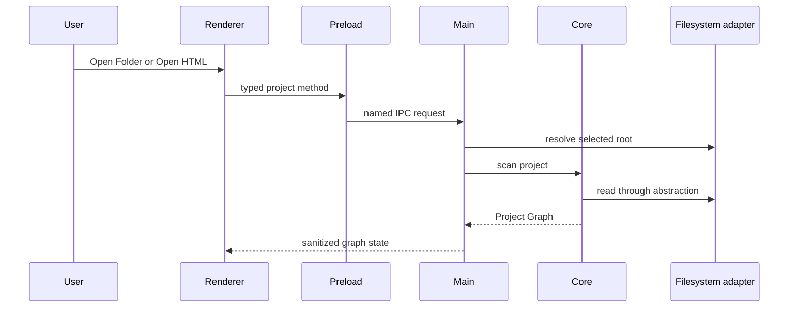

# Project open flow

[Docs index](../../README.md)

## Purpose

Opening a project establishes the trusted root and Project Graph that every later Preview, Snapshot, selection, and command decision depends on.

## Current implementation

Renderer offers Open Folder and Open HTML actions through preload. Electron main owns the native dialog and root resolution. The scan service asks core to discover files and dependencies through filesystem abstractions, then publishes sanitized Project Graph state.

## Key files

- `apps/desktop/electron/main/ipc/register-project-ipc.ts`
- `apps/desktop/electron/main/project/project-scan-service.ts`
- `packages/core/project/project-scanner.ts`
- `packages/core/project/project-graph-builder.ts`
- `packages/adapters/file-system/file-system.adapter.ts`

## Data flow

A cancelled dialog leaves current state unchanged. A valid selection becomes the active root. Core detects pages, direct dependencies, assets, missing local routes, file kinds, metadata, and issues. Main stores and emits the graph. Preview target selection uses that graph instead of arbitrary renderer paths.

## Boundaries

Opening a project grants read and analysis capability to main-owned services. It does not expose the filesystem to renderer, execute project scripts, or create a write grant.

## Validation

Run `validate:project-graph`, `validate:project-watch`, `validate:structure`, and `validate:local:watch` for scanner, graph, watcher, cache, and runtime wiring changes.

## Related docs

- [Repository map](../repository-map.md)
- [Project Preview](../preview/project-preview.md)
- [Project watcher and cache](../../project-watch-cache.md)

## Future work

Richer dependency analyzers, workers, and incremental parsing should preserve active-root ownership and static analysis semantics.
