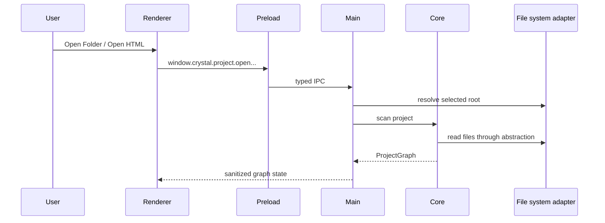

# Project Open Flow

[Docs index](../../README.md)

## At a glance

| Question | Answer |
| --- | --- |
| Is this implemented? | Yes. |
| Can it write files? | No. It scans and stores project state only. |
| Runtime owner | Renderer asks; main resolves filesystem; core scans. |
| Safety risk controlled | Prevents renderer from owning filesystem traversal. |
| Related next phase | Future graph refresh after writes. |

## Purpose

Project open turns a user-selected filesystem location into application state. Every later feature depends on the active root and graph being resolved by main rather than guessed by renderer.

## Why this exists

Without a trusted active root, Preview serving, DOM Snapshot source reads, and command eligibility cannot know what project they belong to.

## How to read this page

Follow the sequence from renderer intent to Project Graph output, then read the failure table for empty or unsafe states.

## Current implementation

The renderer requests Open Folder or Open HTML through preload. Electron main owns dialogs and root resolution. Core scans the selected root through filesystem abstractions and returns Project Graph state.

| Implemented | Blocked | Future |
| --- | --- | --- |
| Folder/HTML open. | Renderer filesystem scan. | Graph refresh after writes. |
| Project Graph scan. | Source mutation. | Richer analyzers. |
| Watch/cache foundation. | Framework alias semantics. | Worker/WASM acceleration. |

## Flow summary

| Step | Actor | Input | Decision | Output |
| --- | --- | --- | --- | --- |
| 1 | User | Folder or HTML intent | Which open action? | Renderer request. |
| 2 | Renderer/preload | Open request | Is API exposed? | Typed IPC. |
| 3 | Main | Dialog result | Can root be resolved? | Active root. |
| 4 | Core | Root + filesystem adapter | What files/dependencies exist? | Project Graph. |
| 5 | Main | Project Graph | What state is safe for renderer? | Sanitized graph state. |

## Key files

Read these files from main orchestration down to core scanning.

## Key files and responsibilities

| File | Responsibility | Reads | Must not do |
| --- | --- | --- | --- |
| `register-project-ipc.ts` | Registers project IPC. | Shared channel constants. | Add write IPC. |
| `project-scan-service.ts` | Coordinates scan lifecycle. | Selected root. | Let renderer scan. |
| `project-scanner.ts` | Finds project files/dependencies. | Filesystem adapter. | Execute scripts. |
| `project-graph-builder.ts` | Builds graph model. | Scan records. | Mutate files. |
| `file-system.adapter.ts` | Filesystem effect wrapper. | Main service calls. | Decide UI policy. |

## Data flow

The selected folder or HTML file defines the active project root. Core detects pages, dependencies, assets, missing routes, file kinds, watcher metadata, and issues. That graph becomes the source for Preview target selection and later eligibility checks.

## Main diagram

## Failure and blocked states

| State | Why it happens | What Crystal does |
| --- | --- | --- |
| No selection | User cancels dialog. | Keeps current state. |
| Root unreadable | Filesystem read fails. | Reports issue through safe state. |
| Missing routes | Graph references unavailable local paths. | Reports graph issues. |
| Write request | Open flow is read-only. | No write path exists. |

## Boundaries

Opening a project grants read and analysis capability through main services, not renderer write authority.

## What this does not do

| Not provided | Reason |
| --- | --- |
| Source writes | Project open is analysis only. |
| Framework semantic analysis | Future analyzer work. |
| TypeScript execution | Scanner is static. |

## Common misunderstanding

> **Common misunderstanding:** Opening a folder does not grant renderer direct filesystem authority.

## Validation

`validate:project-graph`, `validate:project-watch`, `validate:local:watch`, and `validate:structure` cover this flow.

## Related docs

- [Repository map](../repository-map.md)
- [Validation system](../validation-system.md)
- [Project Preview](../preview/project-preview.md)

## Future work

Project Graph can expand into parsed DOM, class/selector ownership, health signals, worker-backed scanning, and Rust/WASM acceleration. Those additions should keep the same root ownership boundary.
