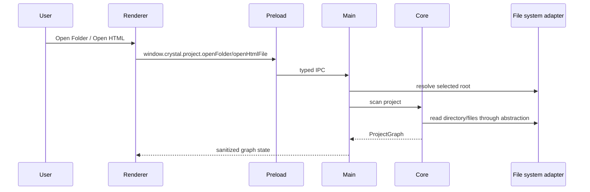

# Project Open Flow

[Docs index](../../README.md)

## Purpose

This document describes how Crystal opens a project folder or standalone HTML file and turns it into Project Graph state.

## Current implementation

The renderer calls the preload project API. Electron main owns dialogs, root resolution, scan orchestration, watcher/cache state, and sanitized result updates. Core scanner and graph builder classify files and dependencies through filesystem abstractions.

## Key files

- `apps/desktop/electron/main/ipc/register-project-ipc.ts`
- `apps/desktop/electron/main/ipc/project-scan-service.ts`
- `apps/desktop/electron/main/ipc/project-services.ts`
- `packages/core/project/scanning/project-scanner.ts`
- `packages/core/project/graph/project-graph-builder.ts`
- `packages/core/project/graph/project-graph.ts`
- `packages/adapters/file-system/file-system.adapter.ts`
- `apps/desktop/electron/renderer/components/project-graph-panel/project-graph-panel.ts`

## Data flow

The selected folder or HTML file defines the active project root. Core scanning detects pages, dependencies, assets, missing routes, file kinds, and issues. Main stores the current graph and emits updates. Renderer never receives raw filesystem authority.

## Boundaries

Opening a project does not imply editing authority. The graph is a read model. Framework alias resolution, TypeScript semantic analysis, CSS cascade, and unused asset analysis are Future.

## Validation

`validate:project-graph`, `validate:project-watch`, `validate:local:watch`, and `validate:structure` cover this flow.

## Related docs

- [Repository map](../repository-map.md)
- [Validation system](../validation-system.md)
- [Project Preview](../preview/project-preview.md)

## Future work

Future graph expansion should add parsed DOM, class/selector ownership, health signals, workers, and Rust/WASM acceleration behind typed boundaries.
