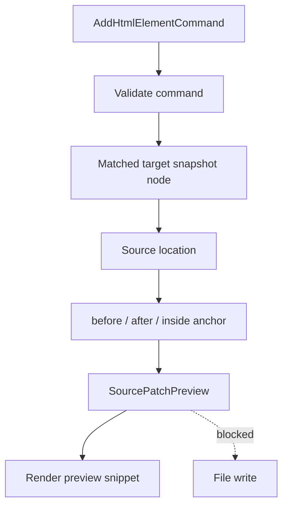

# Source Patch Preview Flow

[Docs index](../../README.md)

## Purpose

This document traces how a dry-run command produces a source patch preview without applying it.

## Current implementation

Source Patch Preview depends on a supported command, matched target, available DOM Snapshot source location, and selected insertion mode. It returns explanatory source text only.

## Key files

- `packages/core/source-patch/html-source-anchor.selectors.ts`
- `packages/core/source-patch/html-source-anchor.types.ts`
- `packages/core/commands/html-insertion/html-insertion-command.planner.ts`
- `packages/core/commands/html-insertion/html-insertion-command.preview.ts`
- `apps/desktop/electron/renderer/components/html-element-library-panel/renderers/command-preview.renderer.ts`

## Data flow

The planner resolves an anchor around the static source location. It generates a small preview snippet. The Command Preview Bus wraps the planner result into a status and summary. Renderer displays it.

## Boundaries

No source file is changed. Missing source locations, stale snapshots, ambiguous mappings, unsupported nodes, and unsafe modes block the preview instead of guessing.

## Validation

`validate:source-patch-preview` guards blocked states and verifies that no write or apply behavior is exposed.

## Related docs

- [Source Patch Preview](../commands/source-patch-preview.md)
- [HTML insertion preview planner](../commands/html-insertion-preview-planner.md)
- [Future write flow](./future-write-flow.md)

## Future work

Future patch application must include conflict detection, formatting, transactional history, and refresh invalidation. This flow remains dry-run until then.
