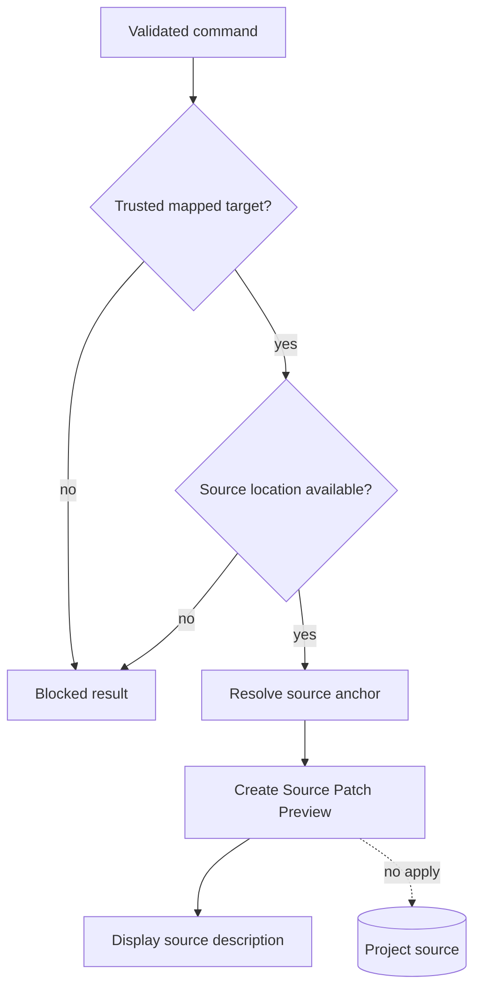

# Source Patch Preview flow

[Docs index](../../README.md)

## Purpose

This flow follows a supported command through source-anchor resolution into an inspectable snippet. Its successful endpoint is still renderer display.

## Current implementation

A validated `AddHtmlElementCommand` and trustworthy target reach the planner. Snapshot source location determines whether before, after, or inside can be represented. Missing, stale, unsafe, or unsupported input blocks. Safe input returns Source Patch Preview through the dry-run bus.

## Key files

- `packages/core/source-patch/html-source-anchor.selectors.ts`
- `packages/core/source-patch/html-source-anchor.types.ts`
- `packages/core/commands/html-insertion/html-insertion-command.planner.ts`
- `packages/core/commands/html-insertion/html-insertion-command.preview.ts`
- `command-preview.renderer.ts`

## Data flow

The planner validates command and mode, resolves source-derived position, generates bounded inserted text, and wraps status and explanation. Renderer never treats the preview as a pending in-memory mutation.

## Boundaries

No file is modified. No patch is applied. No write IPC exists. No transaction executes. Missing evidence blocks preview rather than triggering best-effort insertion.

## Validation

`npm run validate:source-patch-preview` verifies safe anchors, blocked states, preview rendering, and absence of apply/write paths.

## Related docs

- [Source Patch Preview](../commands/source-patch-preview.md)
- [HTML insertion preview planner](../commands/html-insertion-preview-planner.md)
- [Future write flow](./future-write-flow.md)

## Future work

Execution must re-read source, check conflicts, preserve formatting, apply atomically, record reversible history, update dirty state, and refresh derived models.
