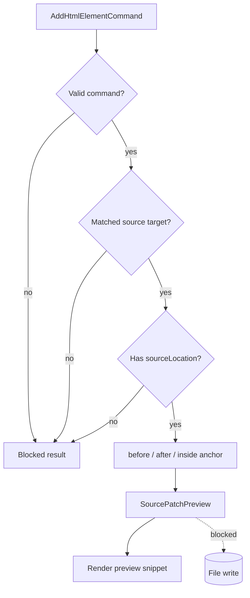

# Source Patch Preview Flow

[Docs index](../../README.md)

## At a glance

| Question | Answer |
| --- | --- |
| Is this implemented? | Yes, as dry-run flow. |
| Can it apply patches? | No. |
| Runtime owner | Core planner produces preview; renderer displays it. |
| Safety risk controlled | Blocks unsafe or unverifiable source positions. |
| Related next phase | Future patch apply with transaction history. |

## Purpose

Source Patch Preview flow turns a validated dry-run command into a visible source-change description. It exists so Crystal can be specific about a possible edit before it has permission to make that edit.

## Why this exists

Without this flow, future editing work would jump directly from UI intent to mutation. The preview makes the planned change inspectable first.

## How to read this page

Focus on the anchor decision. Most blocked states come from missing or unsafe source location data.

## Current implementation

The flow depends on a supported command, matched target, available DOM Snapshot source location, and selected insertion mode. If those inputs are safe, it returns preview text. If they are not, it returns a blocked result.

| Implemented | Blocked | Future |
| --- | --- | --- |
| Anchor-based preview. | Patch apply. | Atomic file write. |
| Blocked states. | File save. | Conflict detection. |
| Renderer preview display. | Write IPC. | Undo transaction. |

## Flow summary

| Step | Actor | Input | Decision | Output |
| --- | --- | --- | --- | --- |
| 1 | Core | Supported command | Is command valid? | Valid command or blocked result. |
| 2 | Core | Matched snapshot node | Is source location available? | Source anchor or blocked result. |
| 3 | Core | Insertion mode | Is mode supported for anchor? | Preview text or blocked result. |
| 4 | Renderer | Preview result | How to display status? | Preview card. |
| 5 | Renderer | Apply action | Is write runtime available? | Disabled/future-only. |

## Key files

These files resolve source anchors and format the dry-run preview.

## Key files and responsibilities

| File | Responsibility | Reads | Must not do |
| --- | --- | --- | --- |
| `html-source-anchor.selectors.ts` | Resolve source anchors. | Snapshot source location. | Guess missing positions. |
| `html-source-anchor.types.ts` | Model anchor shape. | Source position data. | Represent applied edits. |
| `html-insertion-command.planner.ts` | Create preview result. | Command + anchor. | Write files. |
| `html-insertion-command.preview.ts` | Format dry-run payload. | Planner state. | Apply patch. |
| `command-preview.renderer.ts` | Render result. | Preview payload. | Save source. |

## Data flow

The planner resolves an anchor around the static source location, generates a small preview snippet, and wraps the result through the Command Preview Bus. Renderer displays the snippet and status.

## Main diagram

## Failure and blocked states

| State | Why it happens | What Crystal does |
| --- | --- | --- |
| Unsupported command | Bus does not support command type. | Returns unsupported. |
| Missing target | No safe mapped selection. | Blocks preview. |
| Missing source location | Snapshot cannot provide anchor. | Blocks preview. |
| Unsupported mode | Target/mode pair is unsafe. | Blocks preview. |

## Boundaries

No source file is changed. Missing source locations, stale snapshots, ambiguous mappings, unsupported nodes, and unsafe modes block the preview instead of guessing.

## What this does not do

| Not provided | Reason |
| --- | --- |
| Patch apply | No write runtime. |
| File save | No write IPC. |
| Undo record | No transaction state. |

## Common misunderstanding

> **Common misunderstanding:** A source patch preview is not a pending patch in memory waiting to be applied. It is display state.

## Validation

`validate:source-patch-preview` guards blocked states and verifies that no write or apply behavior is exposed.

## Related docs

- [Source Patch Preview](../commands/source-patch-preview.md)
- [HTML insertion preview planner](../commands/html-insertion-preview-planner.md)
- [Future write flow](./future-write-flow.md)

## Future work

Future patch application must add conflict detection, formatting, transaction history, dirty-state handling, and refresh invalidation. This flow remains dry-run until then.
