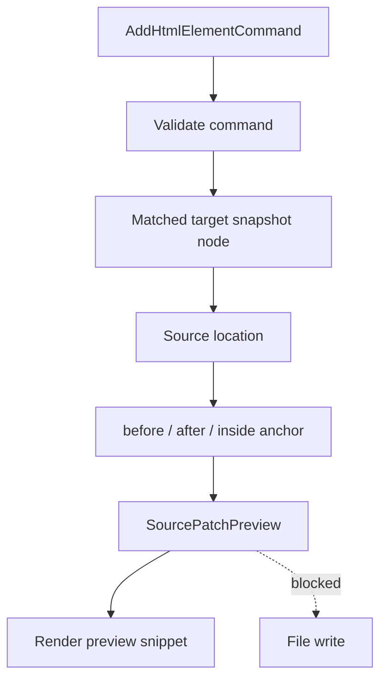

# Source Patch Preview Flow

[Docs index](../../README.md)

## Purpose

Source Patch Preview flow turns a validated dry-run command into a visible source-change description. The flow exists so Crystal can be specific about a possible edit before it has any permission to make that edit.

## Current implementation

The flow depends on a supported command, matched target, available DOM Snapshot source location, and selected insertion mode. If those inputs are safe, it returns preview text. If they are not, it returns a blocked result.

The diagram shows where the write boundary sits. Preview text is the output; file write is not a next step in this phase.

## Key files

These files resolve source anchors and format the dry-run preview.

- `packages/core/source-patch/html-source-anchor.selectors.ts`
- `packages/core/source-patch/html-source-anchor.types.ts`
- `packages/core/commands/html-insertion/html-insertion-command.planner.ts`
- `packages/core/commands/html-insertion/html-insertion-command.preview.ts`
- `apps/desktop/electron/renderer/components/html-element-library-panel/renderers/command-preview.renderer.ts`

## Data flow

The planner resolves an anchor around the static source location, generates a small preview snippet, and wraps the result through the Command Preview Bus. Renderer displays the snippet and status.

## Boundaries

No source file is changed. Missing source locations, stale snapshots, ambiguous mappings, unsupported nodes, and unsafe modes block the preview instead of guessing.

## Validation

`validate:source-patch-preview` guards blocked states and verifies that no write or apply behavior is exposed.

## Related docs

- [Source Patch Preview](../commands/source-patch-preview.md)
- [HTML insertion preview planner](../commands/html-insertion-preview-planner.md)
- [Future write flow](./future-write-flow.md)

## Future work

Future patch application must add conflict detection, formatting, transaction history, dirty-state handling, and refresh invalidation. This flow remains dry-run until then.
