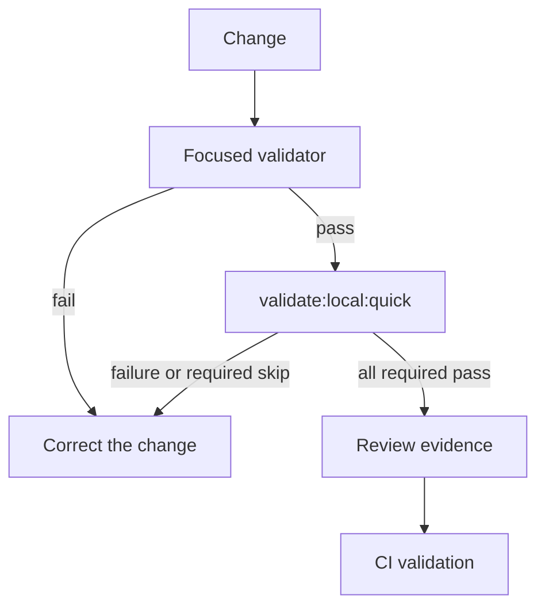

# Validation flow

[Docs index](../../README.md)

## Purpose

Validation decides whether observed repository state satisfies a declared contract. It is especially important where Crystal relies on negative guarantees and generated metadata.

## Current implementation

Focused npm scripts inspect metadata, policy, Markdown, source ownership, build output, models, Preview, UI, and environment. The canonical runner executes 32 required checks and reports PASS, FAIL, or visible SKIPPED. Strict quick validation fails when a required check fails or skips.

## Key files

- `package.json`
- `scripts/validation/validation-suite.mjs`
- `scripts/validation/validation-runner.mjs`
- `scripts/validation/validation-reporter.mjs`
- `scripts/validate-validation-system.mjs`
- `scripts/validate-markdown-integrity.mjs`

## Data flow

The caller selects a command. The validator reads repository state, records checks, and emits explicit errors. Aggregate execution preserves observed status and process output. Report rendering changes format, not semantics. Reviewers compare the result with the changed subsystem and any manual checks.

## Boundaries

Validators do not mutate source, rewrite docs, install missing tools silently, conceal skips, or prove capabilities outside their scope. A command that did not execute is not PASS.

## Validation

The platform self-check is `npm run validate:validation-system`. The strict aggregate gate is `npm run validate:local:quick`; machine consumers should use the silent JSON entrypoint.

## Related docs

- [Validation system](../validation-system.md)
- [Validation platform hardening](../validation-platform-hardening-phase-2.md)
- [Validation gates diagram](../diagrams/validation-gates.md)

## Future work

Add checks with concrete ownership and failure semantics. Import-boundary and write-runtime validators should arrive with the corresponding contracts, not as speculative script growth.
