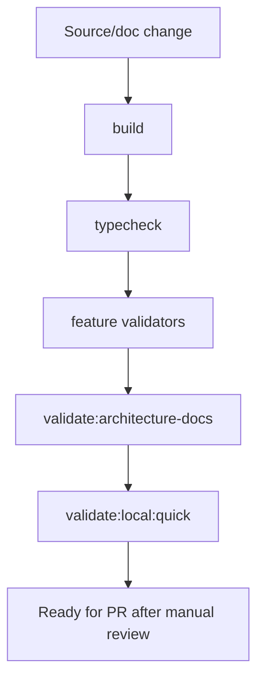

# Validation Flow

[Docs index](../../README.md)

## Purpose

Validation flow explains how a change is checked before it is trusted. It matters in Crystal because many architectural guarantees are negative guarantees: a feature must not write, must not read iframe internals, and must not relax Electron security.

## Current implementation

The root scripts run build, typecheck, structure checks, feature validators, watcher checks, Electron diagnostics, and architecture documentation checks. Validators are source readers, not source modifiers.

The diagram shows documentation validation beside runtime validation. They complement each other but do not prove the same things.

## Key files

Read `package.json` for the command graph, then the specific validator for the feature being changed.

- `package.json`
- `scripts/validate-local.mjs`
- `scripts/validate-structure.mjs`
- `scripts/validate-ui-flow.mjs`
- `scripts/validate-source-patch-preview.mjs`
- `scripts/validate-architecture-docs.mjs`

## Data flow

Validation scripts inspect source, docs, fixtures, and expected strings. They fail with explicit messages and exit non-zero. The docs validator checks navigability and safety language; feature validators check runtime assumptions.

## Boundaries

Passing docs validation does not mean a future feature exists. Passing runtime validation does not allow docs to claim a blocked feature is implemented. Both checks should keep current scope honest.

## Validation

Run `npm run validate:architecture-docs` for docs and `npm run validate:local:quick` for installed local source validation.

## Related docs

- [Validation system](../validation-system.md)
- [Validation gates diagram](../diagrams/validation-gates.md)
- [Repository map](../repository-map.md)

## Future work

Add import-boundary validation and docs path drift checks after the documentation surface stabilizes.
